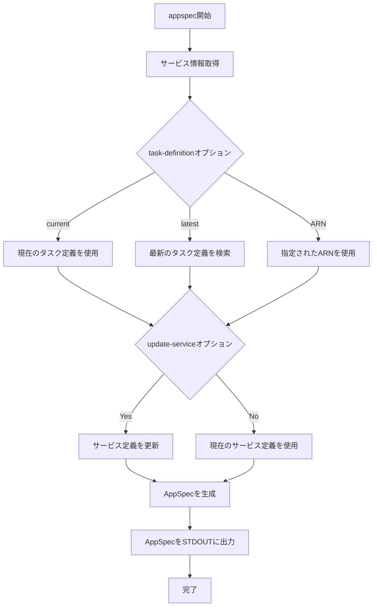

# appspec

`appspec`コマンドは、AWS CodeDeployのためのAppSpecファイルをSTDOUTに出力するために使用します。これにより、CodeDeployを使用したBlue/Greenデプロイメントを設定する際に必要なAppSpecファイルを簡単に生成できます。

## 基本的な使い方

```console
$ ecspresso appspec --config ecspresso.yml
```

## オプション

|| オプション | 説明 | デフォルト値 |
|------------|------|-------------|
|| `--task-definition` | AppSpecで使用するタスク定義ARN（`latest`、`current`、または特定のARN） | `latest` |
|| `--update-service` | タスク定義ARNでサービス定義を更新するかどうか | `true` |

## 使用例

### 最新のタスク定義でAppSpecを生成

```console
$ ecspresso appspec --config ecspresso.yml
```

### 現在のタスク定義でAppSpecを生成

```console
$ ecspresso appspec --config ecspresso.yml --task-definition current
```

### 特定のタスク定義ARNを指定してAppSpecを生成

```console
$ ecspresso appspec --config ecspresso.yml --task-definition arn:aws:ecs:ap-northeast-1:123456789012:task-definition/service-name:10
```

### サービス定義を更新せずにAppSpecを生成

```console
$ ecspresso appspec --config ecspresso.yml --no-update-service
```

## AppSpec生成フロー



## 出力例

```yaml
version: 0.0
Resources:
  - TargetService:
      Type: AWS::ECS::Service
      Properties:
        TaskDefinition: <TASK_DEFINITION>
        LoadBalancerInfo:
          ContainerName: "app"
          ContainerPort: 80
        PlatformVersion: "1.4.0"
```

## 注意事項

- このコマンドは主にCodeDeployを使用したBlue/Greenデプロイメントを設定する際に使用します
- 生成されたAppSpecは必要に応じて編集できます
- `ecspresso.yml`にAppSpecのフックを定義することで、AppSpecにフックを含めることができます
