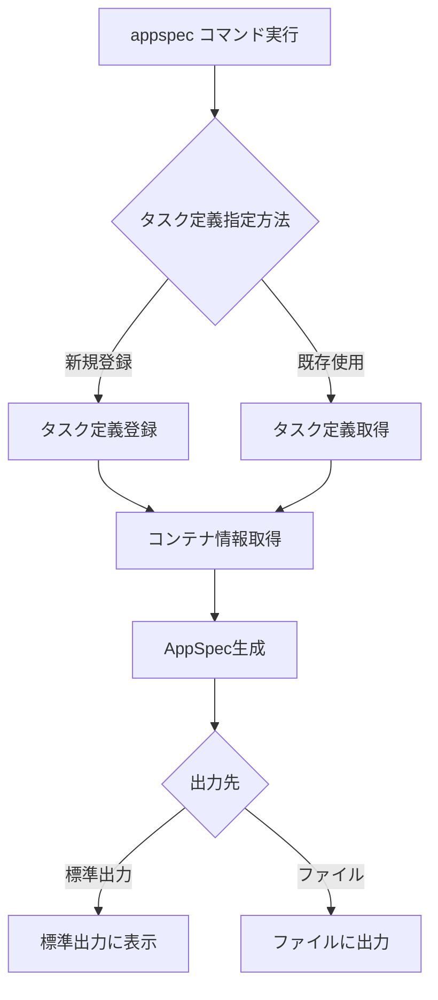

# appspec

`appspec`コマンドは、AWS CodeDeployのAppSpecファイルを生成します。ブルー/グリーンデプロイメントを行う際に使用します。

## 基本的な使い方

```bash
ecspresso appspec
```

## オプション

| オプション | 説明 | デフォルト値 |
|------------|------|------------|
| `--task-def` | タスク定義ファイル | 設定ファイルの`task_definition` |
| `--output` | 出力ファイルパス | - |
| `--container` | コンテナ名 | - |
| `--container-port` | コンテナポート | - |
| `--revision` | タスク定義のリビジョン | `0` |
| `--skip-task-definition` | 新しいタスク定義の登録をスキップ | `false` |
| `--latest-task-definition` | 新しいタスク定義を登録せずに最新のタスク定義を使用 | `false` |

## AppSpecファイルの生成プロセス

`appspec`コマンドは以下のステップを実行します：

1. タスク定義を解決（新規登録または既存のものを使用）
2. サービス定義からコンテナ名とポートを取得（指定されていない場合）
3. AppSpecファイルを生成
4. 標準出力またはファイルに出力



## AppSpecファイルの構造

生成されるAppSpecファイルは以下のような構造になります：

```json
{
  "version": 1,
  "Resources": [
    {
      "TargetService": {
        "Type": "AWS::ECS::Service",
        "Properties": {
          "TaskDefinition": "arn:aws:ecs:ap-northeast-1:123456789012:task-definition/your-task-definition:3",
          "LoadBalancerInfo": {
            "ContainerName": "app",
            "ContainerPort": 80
          }
        }
      }
    }
  ]
}
```

## 使用例

### 基本的な使用方法

```bash
ecspresso appspec
```

### ファイルに出力

```bash
ecspresso appspec --output=appspec.json
```

### コンテナ名とポートを指定

```bash
ecspresso appspec --container=web --container-port=8080
```

### 特定のリビジョンのタスク定義を使用

```bash
ecspresso appspec --skip-task-definition --revision=10
```

## CodeDeployとの統合

`appspec`コマンドで生成したAppSpecファイルは、AWS CodeDeployを使用したブルー/グリーンデプロイメントで使用します。以下は、CI/CDパイプラインでの使用例です：

```bash
# AppSpecファイルを生成
ecspresso appspec --output=appspec.json

# CodeDeployでデプロイメントを作成
aws deploy create-deployment \
  --application-name AppECS-your-cluster-your-service \
  --deployment-group-name DgpECS-your-cluster-your-service \
  --revision revisionType=S3,s3Location="{bucket=your-bucket,key=appspec.json,bundleType=JSON}" \
  --description "Deploy via ecspresso"
```

## 注意事項

- CodeDeployを使用したブルー/グリーンデプロイメントを行う場合のみ使用します。
- サービス定義でロードバランサーが設定されていない場合、`--container`と`--container-port`オプションが必要です。
- タスク定義ファイルが存在しない場合は、エラーが発生します。
