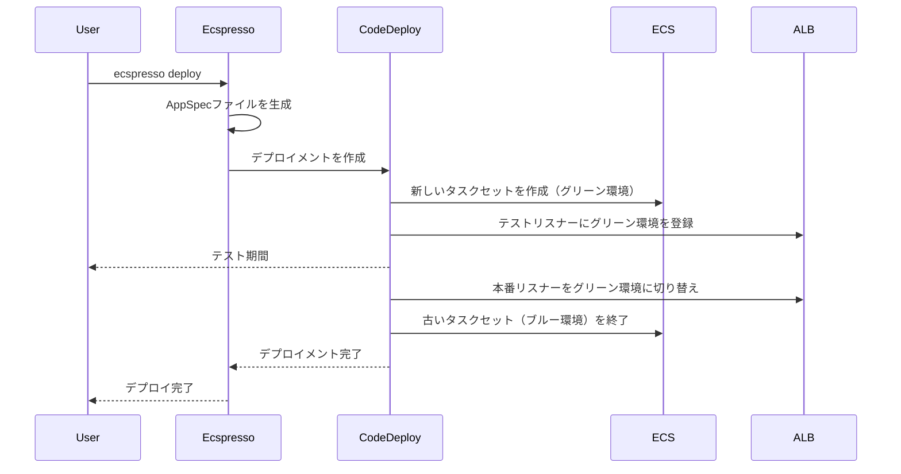

# appspec

`appspec`コマンドは、AWS CodeDeployのAppSpecファイルを生成します。

## 基本的な使い方

```bash
ecspresso appspec --config CONFIG_FILE
```

## オプション

| オプション | 説明 | デフォルト値 |
|------------|------|-------------|
| `--config` | 設定ファイルのパス | `ecspresso.yml` |
| `--task-definition` | タスク定義ファイルのパス | 設定ファイルで指定されたパス |
| `--output` | 出力ファイルのパス | - |
| `--format` | 出力形式（yaml, json） | `yaml` |

## 詳細

`appspec`コマンドは、AWS CodeDeployのBlue/Greenデプロイメントで使用するAppSpecファイルを生成します。AppSpecファイルは、デプロイメントの設定を定義するファイルです。

このコマンドは、以下の処理を行います：

1. 設定ファイルとタスク定義ファイルを読み込む
2. AppSpecファイルを生成する
3. 生成したAppSpecファイルを標準出力または指定されたファイルに出力する

## AppSpecファイルの例

```yaml
version: 0.0
Resources:
  - TargetService:
      Type: AWS::ECS::Service
      Properties:
        TaskDefinition: <TASK_DEFINITION>
        LoadBalancerInfo:
          ContainerName: nginx
          ContainerPort: 80
        PlatformVersion: "1.4.0"
Hooks:
  - BeforeInstall: "LambdaFunctionToValidateBeforeInstall"
  - AfterInstall: "LambdaFunctionToValidateAfterInstall"
  - AfterAllowTestTraffic: "LambdaFunctionToValidateAfterTestTrafficStarts"
  - BeforeAllowTraffic: "LambdaFunctionToValidateBeforeAllowingProductionTraffic"
  - AfterAllowTraffic: "LambdaFunctionToValidateAfterAllowingProductionTraffic"
```

## 使用例

### 基本的な使用例

```bash
ecspresso appspec --config ecspresso.yml
```

### 出力ファイルを指定する例

```bash
ecspresso appspec --config ecspresso.yml --output appspec.yaml
```

### JSON形式で出力する例

```bash
ecspresso appspec --config ecspresso.yml --format json
```

### 特定のタスク定義ファイルを使用する例

```bash
ecspresso appspec --config ecspresso.yml --task-definition my-task-def.json
```

## Blue/Greenデプロイメントでの使用

AppSpecファイルは、AWS CodeDeployを使用したBlue/Greenデプロイメントで使用されます。Blue/Greenデプロイメントは、新しいバージョン（グリーン環境）を既存のバージョン（ブルー環境）と並行して起動し、テスト後に切り替えることで、ダウンタイムを最小限に抑えるデプロイメント手法です。



## ecspresso.ymlでのCodeDeploy設定

AppSpecファイルを使用するには、ecspresso.ymlでCodeDeployの設定を行う必要があります。

```yaml
region: ap-northeast-1
cluster: default
service: myservice
task_definition: ecs-task-def.json
service_definition: ecs-service-def.json
codedeploy:
  application_name: AppECS-default-myservice
  deployment_group_name: DgpECS-default-myservice
  deployment_config_name: CodeDeployDefault.ECSAllAtOnce
  termination_wait_time_in_minutes: 5
  auto_rollback_enabled: true
```

## Hooks

AppSpecファイルでは、デプロイメントの各段階で実行するLambda関数を指定できます。これらのHooksは、デプロイメントの検証やカスタム処理を行うのに役立ちます。

利用可能なHooks：

- `BeforeInstall` - 新しいタスクセットを作成する前に実行
- `AfterInstall` - 新しいタスクセットを作成した後に実行
- `AfterAllowTestTraffic` - テストトラフィックを許可した後に実行
- `BeforeAllowTraffic` - 本番トラフィックを許可する前に実行
- `AfterAllowTraffic` - 本番トラフィックを許可した後に実行
