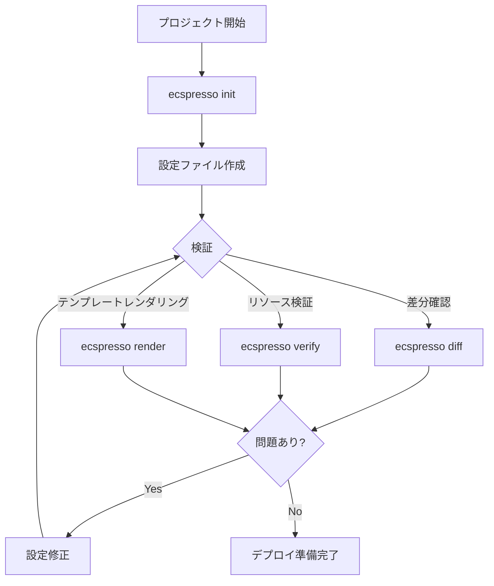

# 設定・検証コマンド

ecspressoの設定と検証に関連するコマンドを説明します。

## init

`init`コマンドは、ecspressoの設定ファイルを初期化します。

```console
$ ecspresso init [オプション]
```

### 主なオプション

| オプション | 説明 |
|------------|------|
| `--region` | AWSリージョン |
| `--cluster` | ECSクラスター名 |
| `--service` | ECSサービス名 |
| `--task-definition` | タスク定義名またはARN |
| `--config` | 設定ファイル名（デフォルト: ecspresso.yml） |

### 使用例

```console
$ ecspresso init --region ap-northeast-1 --cluster my-cluster --service my-service
```

## diff

`diff`コマンドは、ローカルのタスク/サービス定義とリモート（ECS上）の定義の差分を表示します。

```console
$ ecspresso diff [オプション]
```

### 主なオプション

| オプション | 説明 |
|------------|------|
| `--config` | 設定ファイル名 |
| `--task-definition` | タスク定義のJSONファイル |
| `--service-definition` | サービス定義のJSONファイル |
| `--external` | 外部diffコマンドを使用 |

### 使用例

```console
$ ecspresso diff
```

外部diffツールを使用：
```console
$ ecspresso diff --external "difft --color=always"
```

## verify

`verify`コマンドは、サービス/タスク定義に関連するリソースを検証します。

```console
$ ecspresso verify [オプション]
```

### 検証項目

- ECSクラスターの存在
- サービス定義のターゲットグループがタスク定義のコンテナ名とポートと一致するか
- タスクロールとタスク実行ロールが存在し、ecs-tasks.amazonaws.comによって引き受けられるか
- タスク定義で定義されたコンテナイメージがURLに存在するか（ECRまたはDockerHub公開イメージのみ）
- タスク定義のシークレットが存在し、読み取り可能か
- 指定されたCloudWatchロググループストリームにログストリームを作成しメッセージを送信できるか

### 使用例

```console
$ ecspresso verify
```

## render

`render`コマンドは、テンプレート関数を評価してタスク/サービス定義をレンダリングします。

```console
$ ecspresso render [オプション]
```

### 主なオプション

| オプション | 説明 |
|------------|------|
| `--config` | 設定ファイル名 |
| `--task-definition` | タスク定義のJSONファイル |
| `--service-definition` | サービス定義のJSONファイル |

### 使用例

```console
$ ecspresso render
```

## 設定・検証フロー図

以下は設定・検証プロセスのフロー図です：


