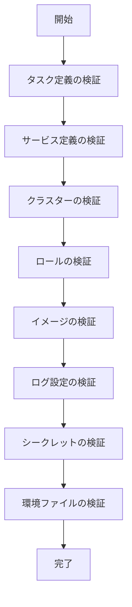

# 設定・初期化コマンド

## init

既存のECSサービスから設定ファイルを作成します。

```
Usage: ecspresso init [flags]

Flags:
  --region=REGION              AWSリージョン
  --cluster=CLUSTER            ECSクラスター名
  --service=SERVICE            ECSサービス名
  --task-definition=ARN        タスク定義ARN（サービスが存在しない場合）
  --config=FILE                設定ファイル名（デフォルト：ecspresso.yml）
  --service-definition=FILE    サービス定義ファイル名（デフォルト：ecs-service-def.json）
  --task-definition-path=FILE  タスク定義ファイル名（デフォルト：ecs-task-def.json）
  --skip-task-definition       タスク定義の取得をスキップ
  --update                     既存の設定ファイルを更新
  --no-save-task-definition    タスク定義ファイルを保存しない
  --output-format=FORMAT       出力フォーマット（json, yaml, jsonnet）（デフォルト：json）
```

### 例

基本的な初期化：
```console
$ ecspresso init --region ap-northeast-1 --cluster default --service myservice
```

Jsonnet形式で出力：
```console
$ ecspresso init --region ap-northeast-1 --cluster default --service myservice --output-format=jsonnet
```

既存の設定を更新：
```console
$ ecspresso init --update
```

## render

設定ファイル、サービス定義、またはタスク定義ファイルを標準出力に出力します。

```
Usage: ecspresso render [flags]

Flags:
  --config                設定ファイルを出力
  --service-definition    サービス定義を出力
  --task-definition      タスク定義を出力
  --output-format=FORMAT 出力フォーマット（json, yaml, jsonnet）（デフォルト：json）
```

### 例

タスク定義をYAML形式で出力：
```console
$ ecspresso render --task-definition --output-format=yaml
```

サービス定義を出力：
```console
$ ecspresso render --service-definition
```

## verify

設定内のリソースを検証します。

```
Usage: ecspresso verify [flags]

Flags:
  --[no-]get-secrets    ParameterStoreまたはSecretsManagerからシークレットを取得（デフォルト：true）
  --[no-]put-logs       CloudWatchLogsにログを出力（デフォルト：true）
  --[no-]cache          キャッシュを使用（デフォルト：true）
```

### 例

リソース検証の実行：
```console
$ ecspresso verify
```

シークレット取得をスキップして検証：
```console
$ ecspresso verify --no-get-secrets
```

### 検証フロー


