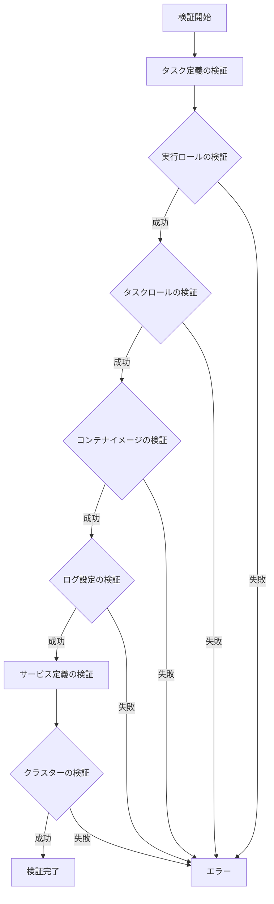
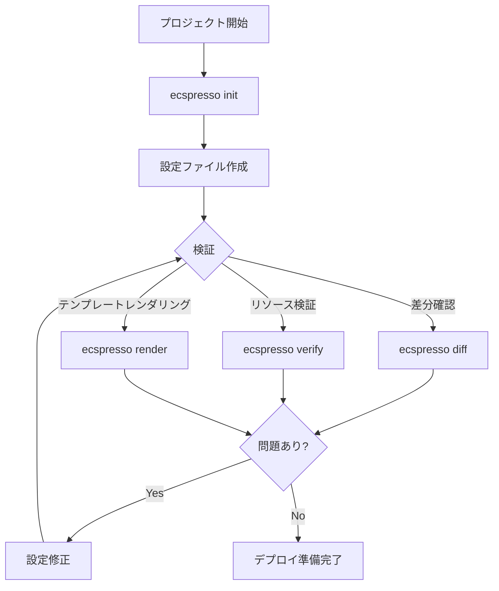

# 設定・検証コマンド

## init

`init`コマンドは、既存のECSサービスから設定ファイルを作成します。

```
ecspresso init --service SERVICE [オプション]
```

### オプション

| オプション | 説明 | デフォルト |
|----------|------|----------|
| `--region REGION` | AWSリージョン | - |
| `--cluster CLUSTER` | ECSクラスター名 | - |
| `--service SERVICE` | 必須：ECSサービス名 | - |
| `--config FILE` | 設定ファイル名 | ecspresso.yml |
| `--task-definition-path FILE` | タスク定義ファイルのパス | ecs-task-def.json |
| `--service-definition-path FILE` | サービス定義ファイルのパス | ecs-service-def.json |

## diff

`diff`コマンドは、タスク定義、サービス定義と現在実行中のサービスおよびタスク定義の差分を表示します。

```
ecspresso diff [オプション]
```

### オプション

| オプション | 説明 | デフォルト |
|----------|------|----------|
| `--unified` | 統一形式で差分を表示 | false |
| `--external CMD` | 外部コマンドを使用して差分を表示 | - |

## verify

`verify`コマンドは、設定内のリソースを検証します。

```
ecspresso verify [オプション]
```

### オプション

| オプション | 説明 | デフォルト |
|----------|------|----------|
| `--task-def FILE` | 検証するタスク定義ファイル | - |

以下のような項目を検証します：
- ECSクラスターの存在
- サービス定義のターゲットグループがタスク定義のコンテナ名とポートと一致するか
- タスクロールとタスク実行ロールが存在し、ecs-tasks.amazonaws.comによって引き受けられるか
- タスク定義で定義されたコンテナイメージがURLに存在するか（ECRまたはDockerHub公開イメージのみ）
- タスク定義のシークレットが存在し読み取り可能か
- 指定されたCloudWatchロググループストリームにログストリームを作成しメッセージを送信できるか

## render

`render`コマンドは、設定、サービス定義、またはタスク定義ファイルをSTDOUTにレンダリングします。

```
ecspresso render <targets> [オプション]
```

### オプション

| オプション | 説明 | デフォルト |
|----------|------|----------|
| `--format FORMAT` | 出力形式（json, yaml, jsonnet） | - |

### 検証フロー



## status

`status`コマンドは、サービスのステータスを表示します。

```
ecspresso status [オプション]
```

### オプション

| オプション | 説明 | デフォルト |
|----------|------|----------|
| `--events N` | 表示するイベント数 | 10 |

## wait

`wait`コマンドは、サービスが安定するまで待機します。

```
ecspresso wait [オプション]
```

### オプション

| オプション | 説明 | デフォルト |
|----------|------|----------|
| `--timeout DURATION` | タイムアウト時間 | - |

## revisions

`revisions`コマンドは、タスク定義のリビジョンを表示します。

```
ecspresso revisions [オプション]
```

### オプション

| オプション | 説明 | デフォルト |
|----------|------|----------|
| `--output FORMAT` | 出力形式 | table |

ecspressoの設定と検証に関連するコマンドを説明します。

## init

`init`コマンドは、ecspressoの設定ファイルを初期化します。v2では、Jsonnet形式の設定ファイルもサポートされるようになりました。

```console
$ ecspresso init [オプション]
```

### 主なオプション

| オプション | 説明 |
|------------|------|
| `--region` | AWSリージョン |
| `--cluster` | ECSクラスター名 |
| `--service` | ECSサービス名 |
| `--task-definition` | タスク定義名またはARN |
| `--config` | 設定ファイル名（デフォルト: ecspresso.yml） |
| `--jsonnet` | Jsonnet形式の設定ファイルを作成します |

### 使用例

```console
$ ecspresso init --region ap-northeast-1 --cluster my-cluster --service my-service
```

Jsonnet形式の設定ファイルを作成：
```console
$ ecspresso init --region ap-northeast-1 --cluster my-cluster --service my-service --jsonnet
```

## diff

`diff`コマンドは、ローカルのタスク/サービス定義とリモート（ECS上）の定義の差分を表示します。v2では、`--unified`オプションがデフォルトでtrueになり、外部diffコマンドのサポートが追加されました。

```console
$ ecspresso diff [オプション]
```

### 主なオプション

| オプション | 説明 |
|------------|------|
| `--config` | 設定ファイル名 |
| `--task-definition` | タスク定義のJSONファイル |
| `--service-definition` | サービス定義のJSONファイル |
| `--unified` | 統合形式で差分を表示します（v2ではデフォルトでtrue） |
| `--external` | 外部diffコマンドを使用します |

### 使用例

```console
$ ecspresso diff
```

外部diffツールを使用：
```console
$ ecspresso diff --external "difft --color=always"
```

非統合形式で表示：
```console
$ ecspresso diff --unified=false
```

## verify

`verify`コマンドは、サービス/タスク定義に関連するリソースを検証します。v2では、コンテナイメージプラットフォームの検証機能が追加され、IAMロールのexecutionRoleへのロールバックが行われなくなりました。

```console
$ ecspresso verify [オプション]
```

### 検証項目

- ECSクラスターの存在
- サービス定義のターゲットグループがタスク定義のコンテナ名とポートと一致するか
- タスクロールとタスク実行ロールが存在し、ecs-tasks.amazonaws.comによって引き受けられるか
- タスク定義で定義されたコンテナイメージがURLに存在するか（ECRまたはDockerHub公開イメージのみ）
- コンテナイメージのプラットフォームがタスク定義と一致するか
- タスク定義のシークレットが存在し、読み取り可能か（AWS Secrets ManagerとSSMパラメータストア）
- 指定されたCloudWatchロググループストリームにログストリームを作成しメッセージを送信できるか

### 主なオプション

| オプション | 説明 |
|------------|------|
| `--config` | 設定ファイル名 |
| `--timeout` | 検証のタイムアウト時間 |

### 使用例

```console
$ ecspresso verify
```

タイムアウトを指定して検証：
```console
$ ecspresso verify --timeout 5m
```

## render

`render`コマンドは、テンプレート関数を評価してタスク/サービス定義をレンダリングします。v2では、コマンドがフラグではなく引数を受け付けるようになり、Jsonnetサポートが追加されました。

```console
$ ecspresso render [引数] [オプション]
```

### 主なオプション

| オプション | 説明 |
|------------|------|
| `--config` | 設定ファイル名 |
| `--task-definition` | タスク定義のJSONファイル |
| `--service-definition` | サービス定義のJSONファイル |
| `--jsonnet` | Jsonnet形式の入力をレンダリングします |

### 使用例

```console
$ ecspresso render task
```

サービス定義をレンダリング：
```console
$ ecspresso render service
```

Jsonnet形式の入力をレンダリング：
```console
$ ecspresso render task --jsonnet
```

## プラグインシステム

v2では、外部プラグインとSSMパラメータストアプラグイン、Secrets Managerプラグインがサポートされました。

### SSMパラメータストアプラグイン

タスク定義内でSSMパラメータを参照できます：

```json
{
  "containerDefinitions": [
    {
      "secrets": [
        {
          "name": "DB_PASSWORD",
          "valueFrom": "arn:aws:ssm:ap-northeast-1:123456789012:parameter/myapp/db/password"
        }
      ]
    }
  ]
}
```

### Secrets Managerプラグイン

タスク定義内でSecrets Managerのシークレットを参照できます：

```json
{
  "containerDefinitions": [
    {
      "secrets": [
        {
          "name": "DB_PASSWORD",
          "valueFrom": "arn:aws:secretsmanager:ap-northeast-1:123456789012:secret:myapp/db/password"
        }
      ]
    }
  ]
}
```

### 外部プラグイン

カスタム外部プラグインを使用して、設定ファイルやタスク定義を拡張できます：

```yaml
# ecspresso.yml
plugins:
  - name: my-plugin
    command: /path/to/plugin
```

## 設定・検証フロー図

以下は設定・検証プロセスのフロー図です：


