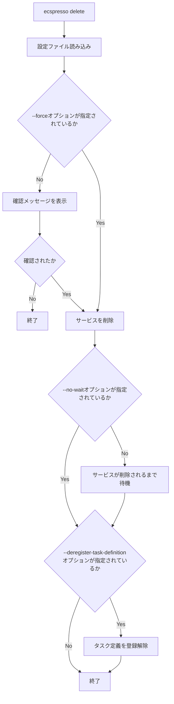

# delete

`delete`コマンドは、ECSサービスを削除します。

## 基本的な使い方

```bash
ecspresso delete --config CONFIG_FILE
```

## オプション

| オプション | 説明 | デフォルト値 |
|------------|------|-------------|
| `--config` | 設定ファイルのパス | `ecspresso.yml` |
| `--force` | 確認なしで削除するかどうか | `false` |
| `--no-wait` | サービスが削除されるまで待機しないかどうか | `false` |
| `--deregister-task-definition` | タスク定義も登録解除するかどうか | `false` |
| `--timeout` | タイムアウト時間 | 設定ファイルで指定されたタイムアウト |

## 詳細

`delete`コマンドは、以下の処理を行います：

1. 設定ファイルからサービス情報を読み込む
2. ECSサービスを削除する
3. サービスが削除されるまで待機する（`--no-wait`が指定されていない場合）
4. タスク定義を登録解除する（`--deregister-task-definition`が指定されている場合）

このコマンドは、不要になったサービスを削除するのに役立ちます。

## 削除フロー



## 使用例

### 基本的な使用例

```bash
ecspresso delete --config ecspresso.yml
```

### 確認なしで削除する例

```bash
ecspresso delete --config ecspresso.yml --force
```

### 待機せずに削除する例

```bash
ecspresso delete --config ecspresso.yml --no-wait
```

### タスク定義も登録解除する例

```bash
ecspresso delete --config ecspresso.yml --deregister-task-definition
```

### タイムアウトを指定する例

```bash
ecspresso delete --config ecspresso.yml --timeout 5m
```

## 注意事項

- サービスを削除すると、実行中のタスクも停止されます。
- サービスを削除しても、タスク定義は自動的に登録解除されません。タスク定義も登録解除するには、`--deregister-task-definition`オプションを指定します。
- サービスを削除しても、関連するリソース（ロードバランサー、ターゲットグループ、セキュリティグループなど）は自動的に削除されません。これらのリソースは手動で削除する必要があります。
- サービスを削除する前に、サービスのタスク数を0に設定することをお勧めします。これにより、サービスの削除が速くなります。

## サービス削除の確認

`--force`オプションを指定しない場合、サービスを削除する前に確認メッセージが表示されます。

```
Are you sure want to delete service 'myservice' in cluster 'default'? [y/N]
```

「y」または「Y」を入力すると、サービスが削除されます。それ以外の入力では、削除がキャンセルされます。

## タスク定義の登録解除

`--deregister-task-definition`オプションを指定すると、サービスの削除後にタスク定義が登録解除されます。これにより、不要なタスク定義がAWSアカウントに残らないようにできます。

ただし、タスク定義の登録解除は、そのタスク定義を使用している他のサービスやタスクがない場合にのみ行うべきです。
