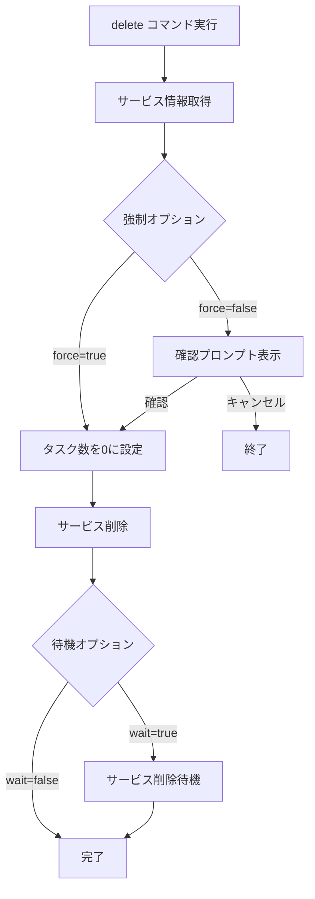

# delete

`delete`コマンドは、ECSサービスを削除します。サービスに関連するタスクも停止されますが、タスク定義は削除されません。

## 基本的な使い方

```bash
ecspresso delete
```

## オプション

| オプション | 説明 | デフォルト値 |
|------------|------|------------|
| `--dry-run` | 実際の変更を行わずに実行 | `false` |
| `--force` | 確認プロンプトをスキップ | `false` |
| `--wait` | サービスが削除されるまで待機 | `true` |
| `--no-wait` | サービスが削除されるまで待機しない | - |

## 削除プロセス

`delete`コマンドは以下のステップを実行します：

1. サービスの現在の状態を取得
2. 確認プロンプトを表示（`--force`が指定されていない場合）
3. サービスのタスク数を0に設定
4. サービスを削除
5. サービスが削除されるまで待機（`--wait`が指定されている場合）



## 確認プロンプト

`--force`オプションが指定されていない場合、`delete`コマンドは削除前に確認プロンプトを表示します：

```
Service: your-service
  Status: ACTIVE
  TaskDefinition: your-task-definition:3
  DesiredCount: 2
  PendingCount: 0
  RunningCount: 2
Are you sure to DELETE the service? [y/N]
```

`y`または`Y`を入力すると削除が実行され、それ以外の入力ではキャンセルされます。

## 使用例

### 基本的な使用方法

```bash
ecspresso delete
```

### 確認プロンプトをスキップして削除

```bash
ecspresso delete --force
```

### ドライランモードで削除

```bash
ecspresso delete --dry-run
```

### 待機せずに削除

```bash
ecspresso delete --no-wait
```

## 注意事項

- サービスが存在しない場合は、エラーが発生します。
- サービスに関連するタスクは停止されますが、タスク定義は削除されません。
- サービスに関連するAuto Scaling設定は削除されます。
- CodeDeployを使用している場合、CodeDeployのアプリケーションとデプロイメントグループは削除されません。
- ロードバランサーのターゲットグループは削除されません。
- `--dry-run`オプションを使用すると、実際の変更は行われず、削除される内容が表示されます。
