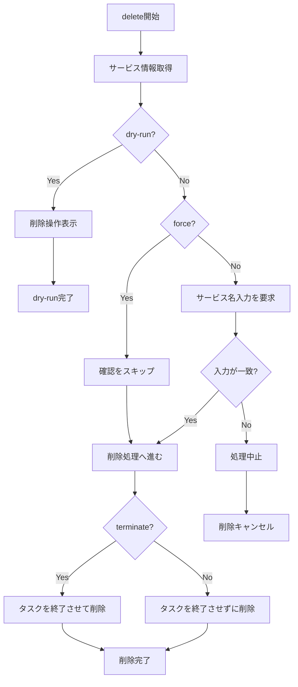

# delete

`delete`コマンドは、ECSサービスを削除するために使用します。サービスを削除する前に確認が求められます。

## 基本的な使い方

```console
$ ecspresso delete --config ecspresso.yml
```

## オプション

|| オプション | 説明 | デフォルト値 |
|------------|------|-------------|
|| `--dry-run` | 実際に削除せずに、実行される操作を表示します | `false` |
|| `--force` | 確認なしで削除します | `false` |
|| `--terminate` | タスクを終了させて削除します | `false` |

## 使用例

### ドライランモード（実際に削除せずに確認）

```console
$ ecspresso delete --config ecspresso.yml --dry-run
```

### 確認なしで削除

```console
$ ecspresso delete --config ecspresso.yml --force
```

### タスクを終了させて削除

```console
$ ecspresso delete --config ecspresso.yml --terminate
```

## 削除フロー



## 注意事項

- サービスを削除すると、そのサービスに関連するタスクも停止します
- `--force`オプションを使用しない場合、安全のために削除前にサービス名の入力が求められます
- `--terminate`オプションを使用すると、サービスのタスクが強制的に終了します（AWS ECS DeleteServiceのforceパラメータに相当）
- 削除したサービスは復元できないため、慎重に使用してください
