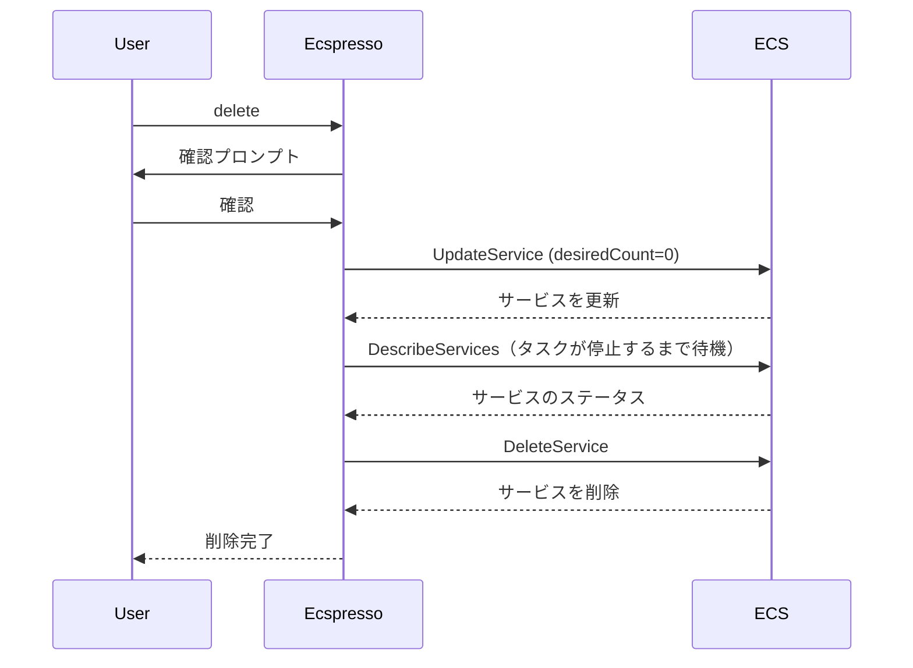

# delete

`delete`コマンドは、ECSサービスを削除するために使用します。

## 構文

```
ecspresso delete [オプション]
```

## オプション

| オプション | 説明 | デフォルト値 |
|------------|------|-------------|
| `--dry-run` | 実際の変更を行わずに実行内容を表示 | `false` |
| `--force` | 確認プロンプトをスキップ | `false` |

## 使用例

### 基本的な使用方法

```bash
ecspresso delete
```

このコマンドを実行すると、確認プロンプトが表示されます。

### 確認プロンプトをスキップして削除

```bash
ecspresso delete --force
```

### ドライランモードでの実行

```bash
ecspresso delete --dry-run
```

## 削除プロセス

サービスを削除する前に、ecspressoは以下の手順を実行します：

1. サービスの希望タスク数を0に設定
2. すべてのタスクが停止するまで待機
3. サービスを削除



## 注意事項

- サービスを削除すると、関連するタスクも停止されますが、タスク定義は削除されません。
- ロードバランサーやターゲットグループなどの関連リソースも削除されません。
- 削除操作は元に戻せないため、特に本番環境では注意が必要です。

## 関連コマンド

- [deploy](./deploy.html) - サービスをデプロイ
- [scale](./scale.html) - サービスをスケール（タスク数を変更）
