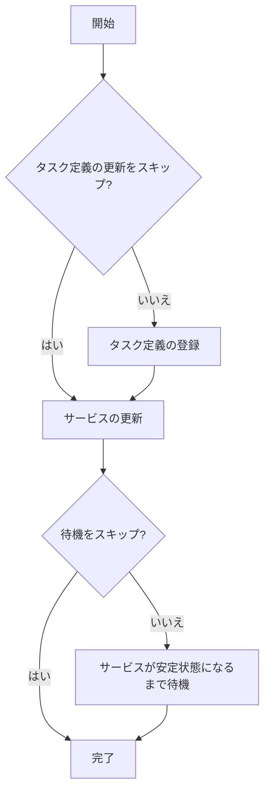

# deploy

`deploy`コマンドは、ECSサービスをデプロイするためのコマンドです。タスク定義の登録とサービスの更新を行います。

## 基本的な使い方

```console
$ ecspresso deploy [オプション]
```

## オプション

| オプション | 説明 | デフォルト値 |
|------------|------|------------|
| `--config` | 設定ファイルのパス | `ecspresso.yml` |
| `--dry-run` | 実際にデプロイせずに実行内容を表示 | `false` |
| `--no-wait` | サービスが安定状態になるまで待機しない | `false` |
| `--force-new-deployment` | 現在のタスク定義を使用して強制的に新しいデプロイを開始 | `false` |
| `--skip-task-definition` | タスク定義の更新をスキップ | `false` |
| `--rollback-events` | 指定されたイベントが発生した場合に自動的にロールバック | - |
| `--update-service` | サービスの更新のみを行い、タスク定義は更新しない | `false` |
| `--latest-task-definition` | 最新のタスク定義を使用 | `false` |
| `--revision` | 特定のリビジョンのタスク定義を使用 | - |
| `--suspend-auto-scaling` | デプロイ中に自動スケーリングを一時停止 | `false` |
| `--resume-auto-scaling` | デプロイ後に自動スケーリングを再開 | `false` |
| `--tasks` | デプロイするタスク数 | - |
| `--wait-until` | 待機条件（`stable`または`deployed`） | `stable` |
| `--envfile` | 環境変数ファイルのパス | - |
| `--ext-str` | Jsonnet用の外部文字列値 | - |
| `--ext-code` | Jsonnet用の外部コード値 | - |

## デプロイプロセス

`deploy`コマンドは、以下のプロセスでデプロイを実行します：

1. タスク定義ファイルから新しいタスク定義を登録（`--skip-task-definition`が指定されていない場合）
2. サービス定義ファイルに基づいてサービスを更新
3. サービスが安定状態になるまで待機（`--no-wait`が指定されていない場合）



## 出力例

### 通常実行

```
2023/01/01 12:00:00 [info] myservice/default Starting deploy
Service: myservice
Cluster: default
TaskDefinition: myservice:3
Deployments:
    PRIMARY myservice:3 desired:1 pending:0 running:1
Events:
2023/01/01 12:00:00 [info] myservice/default Creating a new task definition by ecs-task-def.json
2023/01/01 12:00:00 [info] myservice/default Registering a new task definition...
2023/01/01 12:00:00 [info] myservice/default Task definition is registered myservice:4
2023/01/01 12:00:00 [info] myservice/default Updating service...
2023/01/01 12:00:00 [info] myservice/default Waiting for service stable...(it will take a few minutes)
2023/01/01 12:00:00 [info] myservice/default  PRIMARY myservice:4 desired:1 pending:0 running:1
2023/01/01 12:00:00 [info] myservice/default Service is stable now. Completed!
```

### ドライラン

```
2023/01/01 12:00:00 [info] myservice/default Starting deploy
Service: myservice
Cluster: default
TaskDefinition: myservice:3
Deployments:
    PRIMARY myservice:3 desired:1 pending:0 running:1
Events:
2023/01/01 12:00:00 [info] myservice/default DRY RUN: create a new task definition by ecs-task-def.json
2023/01/01 12:00:00 [info] myservice/default DRY RUN: register task definition
2023/01/01 12:00:00 [info] myservice/default DRY RUN: update service
2023/01/01 12:00:00 [info] myservice/default DRY RUN: wait for service stable
2023/01/01 12:00:00 [info] myservice/default Deploy completed!
```

## 使用例

### 基本的なデプロイ

```console
$ ecspresso deploy --config ecspresso.yml
```

### ドライランでデプロイ内容を確認

```console
$ ecspresso deploy --config ecspresso.yml --dry-run
```

### サービスの安定状態を待機せずにデプロイ

```console
$ ecspresso deploy --config ecspresso.yml --no-wait
```

### 強制的に新しいデプロイを開始

```console
$ ecspresso deploy --config ecspresso.yml --force-new-deployment
```

### タスク定義の更新をスキップ

```console
$ ecspresso deploy --config ecspresso.yml --skip-task-definition
```

### デプロイ失敗時に自動的にロールバック

```console
$ ecspresso deploy --config ecspresso.yml --rollback-events DEPLOYMENT_FAILURE
```

### 特定のリビジョンのタスク定義を使用

```console
$ ecspresso deploy --config ecspresso.yml --revision 3
```

### 環境変数ファイルを使用

```console
$ ecspresso deploy --config ecspresso.yml --envfile production.env
```

### Jsonnet用の外部変数を指定

```console
$ ecspresso deploy --config ecspresso.yml --ext-str IMAGE_TAG=v1.2.3 --ext-str ENV=production
```

## Blue/Greenデプロイ

ecspressoは、AWS CodeDeployと連携してBlue/Greenデプロイをサポートしています。Blue/Greenデプロイを使用するには、以下の設定が必要です：

1. サービス定義ファイルで、デプロイメントコントローラーをCodeDeployに設定：

```jsonc
{
  "deploymentController": {
    "type": "CODE_DEPLOY"
  },
  "loadBalancers": [
    {
      "targetGroupArn": "arn:aws:elasticloadbalancing:ap-northeast-1:123456789012:targetgroup/blue/0123456789abcdef",
      "containerName": "web",
      "containerPort": 80
    }
  ]
}
```

2. ecspresso.ymlにCodeDeployの設定を追加：

```yaml
region: ap-northeast-1
cluster: default
service: myservice
service_definition: ecs-service-def.json
task_definition: ecs-task-def.json
codedeploy:
  application_name: AppECS-default-myservice
  deployment_group_name: DgpECS-default-myservice
  deployment_config_name: CodeDeployDefault.ECSAllAtOnce
  auto_rollback_on_error: true
```

3. デプロイを実行：

```console
$ ecspresso deploy --rollback-events DEPLOYMENT_FAILURE
```

## 自動スケーリングの管理

デプロイ中に自動スケーリングを一時停止し、デプロイ後に再開することができます：

```console
$ ecspresso deploy --config ecspresso.yml --suspend-auto-scaling --resume-auto-scaling
```

## 注意事項

- `--dry-run`オプションを使用すると、実際の変更を適用せずに実行内容を確認できます
- `--no-wait`オプションを使用すると、サービスが安定状態になるまで待機せずにデプロイが完了します
- `--force-new-deployment`オプションは、タスク定義を変更せずに新しいデプロイを開始する場合に便利です
- `--skip-task-definition`オプションは、サービスの設定のみを更新する場合に使用します
- `--rollback-events`オプションを使用すると、指定されたイベントが発生した場合に自動的にロールバックされます
- Blue/Greenデプロイを使用する場合は、サービス定義ファイルとecspresso.ymlの両方で設定が必要です
- 環境変数ファイルを使用すると、複数の環境（開発、ステージング、本番）で同じ設定ファイルを使用できます
- Jsonnetを使用する場合は、`--ext-str`または`--ext-code`オプションで外部変数を渡すことができます

## 関連コマンド

- [rollback](./rollback.html) - 以前のタスク定義にロールバック
- [status](./status.html) - サービスの状態を表示
- [wait](./wait.html) - サービスが安定状態になるまで待機
- [diff](./diff.html) - ローカルの設定ファイルと現在のサービスとの差分を表示
