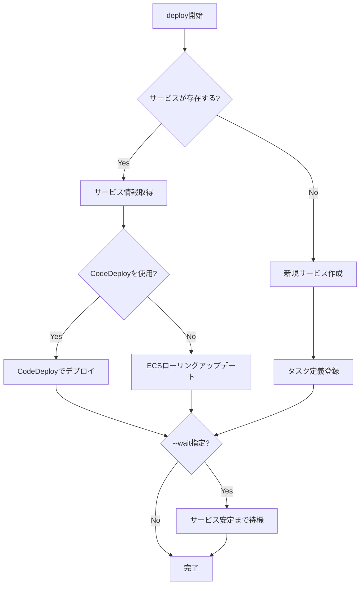

# deploy

`deploy`コマンドは、ECSサービスをデプロイするために使用します。新しいタスク定義を登録し、サービスを更新します。サービスが存在しない場合は、新しいサービスを作成します。

## 基本的な使い方

```console
$ ecspresso deploy --config ecspresso.yml
```

## オプション

| オプション | 説明 | デフォルト値 |
|------------|------|-------------|
| `--dry-run` | 実際にデプロイせずに、実行される操作を表示します | `false` |
| `--tasks N` | タスクの希望数を指定します | 現在の値を維持 |
| `--skip-task-definition` | 新しいタスク定義の登録をスキップします | `false` |
| `--revision N` | `--skip-task-definition`使用時に実行するタスク定義のリビジョン | `0` (最新) |
| `--force-new-deployment` | サービスの強制的な新規デプロイメントを行います | `false` |
| `--wait` | サービスが安定するまで待機します | `true` |
| `--wait-until` | サービスが安定するまで待機するか、デプロイメントが完了するまで待機するかを選択します（`stable`または`deployed`） | `stable` |
| `--suspend-auto-scaling` | ECSサービスに関連付けられたアプリケーションのオートスケーリングを一時停止します | - |
| `--resume-auto-scaling` | ECSサービスに関連付けられたアプリケーションのオートスケーリングを再開します | - |
| `--auto-scaling-min N` | ECSサービスに関連付けられたアプリケーションのオートスケーリングの最小容量を設定します | - |
| `--auto-scaling-max N` | ECSサービスに関連付けられたアプリケーションのオートスケーリングの最大容量を設定します | - |
| `--rollback-events EVENT` | 指定されたイベントが発生した場合にロールバックします（`DEPLOYMENT_FAILURE,DEPLOYMENT_STOP_ON_ALARM,DEPLOYMENT_STOP_ON_REQUEST,...`）CodeDeployのみ | - |
| `--update-service` | サービス定義によってサービス属性を更新します | `true` |
| `--latest-task-definition` | 新しいタスク定義を登録せずに、最新のタスク定義でデプロイします | `false` |

## 使用例

### 基本的なデプロイ

```console
$ ecspresso deploy --config ecspresso.yml
```

### ドライランモード（実際にデプロイせず変更内容を確認）

```console
$ ecspresso deploy --config ecspresso.yml --dry-run
```

### タスク数を指定してデプロイ

```console
$ ecspresso deploy --config ecspresso.yml --tasks 5
```

### 強制的に新しいデプロイメントを作成

```console
$ ecspresso deploy --config ecspresso.yml --force-new-deployment
```

### タスク定義の更新をスキップ

```console
$ ecspresso deploy --config ecspresso.yml --skip-task-definition
```

### 特定のリビジョンのタスク定義を使用

```console
$ ecspresso deploy --config ecspresso.yml --skip-task-definition --revision 10
```

### オートスケーリングの設定を変更

```console
$ ecspresso deploy --config ecspresso.yml --auto-scaling-min 2 --auto-scaling-max 10
```

### CodeDeployを使用したデプロイでロールバックイベントを設定

```console
$ ecspresso deploy --config ecspresso.yml --rollback-events DEPLOYMENT_FAILURE
```

## デプロイフロー

`deploy`コマンドの実行フローは以下の通りです：



## 注意事項

- `--wait`オプションを指定すると、サービスが安定状態になるまでコマンドはブロックされます
- `--wait-until`オプションで`deployed`を指定すると、デプロイメントが完了した時点で待機が終了します（サービスが完全に安定していなくても）
- CodeDeployを使用したBlue/Greenデプロイメントの場合、`--rollback-events`オプションを使用して自動ロールバックを設定できます
- オートスケーリングの設定を変更する場合、`--suspend-auto-scaling`と`--resume-auto-scaling`は同時に指定できません
