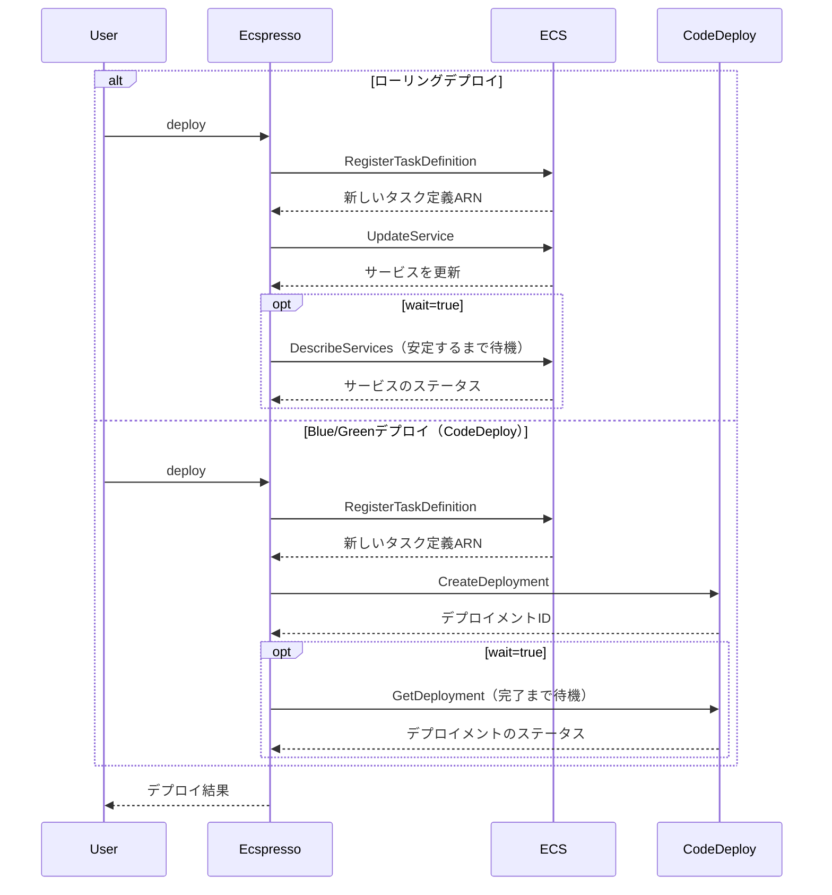

# deploy

`deploy`コマンドは、ECSサービスをデプロイするために使用します。新しいタスク定義の登録、サービス属性の更新、デプロイの実行を行います。

## 構文

```
ecspresso deploy [オプション]
```

## オプション

| オプション | 説明 | デフォルト値 |
|------------|------|-------------|
| `--dry-run` | 実際の変更を行わずに実行内容を表示 | `false` |
| `--tasks N` | タスクの希望数 | -1（現在の値を維持） |
| `--skip-task-definition` | 新しいタスク定義の登録をスキップ | `false` |
| `--revision N` | `--skip-task-definition`指定時に使用するタスク定義のリビジョン | `0` |
| `--force-new-deployment` | サービスの新しいデプロイメントを強制 | `false` |
| `--wait/--no-wait` | サービスが安定するまで待機するかどうか | `true` |
| `--wait-until` | どの状態まで待機するか（stable/deployed） | `stable` |
| `--suspend-auto-scaling` | ECSサービスに関連付けられたアプリケーションオートスケーリングを一時停止 | - |
| `--resume-auto-scaling` | ECSサービスに関連付けられたアプリケーションオートスケーリングを再開 | - |
| `--auto-scaling-min N` | アプリケーションオートスケーリングの最小キャパシティを設定 | - |
| `--auto-scaling-max N` | アプリケーションオートスケーリングの最大キャパシティを設定 | - |
| `--rollback-events` | 指定したイベント発生時にロールバック（DEPLOYMENT_FAILURE,DEPLOYMENT_STOP_ON_ALARM,DEPLOYMENT_STOP_ON_REQUEST,...）CodeDeployのみ | `` |
| `--update-service/--no-update-service` | サービス定義によってサービス属性を更新するかどうか | `true` |
| `--latest-task-definition` | 新しいタスク定義を登録せずに最新のタスク定義でデプロイ | `false` |

## 使用例

### 基本的なデプロイ

```bash
ecspresso deploy
```

### ドライランモードでの実行

変更内容を確認するためのドライラン：

```bash
ecspresso deploy --dry-run
```

### タスク数を指定したデプロイ

```bash
ecspresso deploy --tasks 5
```

### 強制的に新しいデプロイメントを作成

```bash
ecspresso deploy --force-new-deployment
```

### タスク定義の更新をスキップしてデプロイ

```bash
ecspresso deploy --skip-task-definition
```

### CodeDeployを使用したBlue/Greenデプロイとロールバック設定

```bash
ecspresso deploy --rollback-events DEPLOYMENT_FAILURE,DEPLOYMENT_STOP_ON_ALARM
```

## デプロイフロー図



## 関連コマンド

- [refresh](./refresh.html) - サービスを更新（`deploy --skip-task-definition --force-new-deployment --no-update-service`と同等）
- [scale](./scale.html) - サービスをスケール（`deploy --skip-task-definition --no-update-service`と同等）
- [rollback](./rollback.html) - サービスをロールバック
