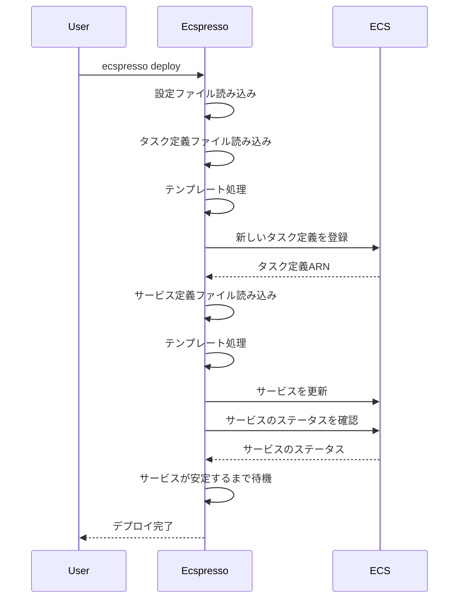
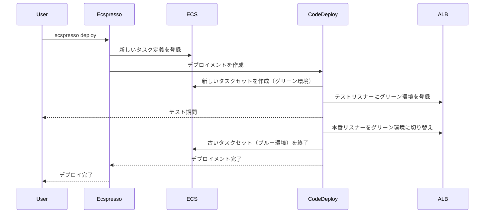

# deploy

`deploy`コマンドは、ECSサービスをデプロイします。

## 基本的な使い方

```bash
ecspresso deploy --config CONFIG_FILE
```

## オプション

| オプション | 説明 | デフォルト値 |
|------------|------|-------------|
| `--config` | 設定ファイルのパス | `ecspresso.yml` |
| `--skip-task-definition` | タスク定義の登録をスキップするかどうか | `false` |
| `--skip-service-update` | サービスの更新をスキップするかどうか | `false` |
| `--no-update-service` | サービスの更新をスキップするかどうか（`--skip-service-update`と同等） | `false` |
| `--force-new-deployment` | 強制的に新しいデプロイメントを作成するかどうか | `false` |
| `--no-wait` | サービスが安定するまで待機しないかどうか | `false` |
| `--suspend-auto-scaling` | Auto Scalingを一時停止するかどうか | `false` |
| `--resume-auto-scaling` | デプロイ後にAuto Scalingを再開するかどうか | `false` |
| `--rollback-events` | 自動ロールバックをトリガーするイベント | - |
| `--tasks` | サービスのタスク数 | - |
| `--revision` | 使用するタスク定義のリビジョン | - |
| `--latest-task-definition` | 最新のタスク定義を使用するかどうか | `false` |
| `--update-service` | サービスの更新のみを行うかどうか | `false` |
| `--overrides` | タスク定義のオーバーライド（JSON形式） | - |

## 詳細

`deploy`コマンドは、以下の処理を行います：

1. タスク定義ファイルから新しいタスク定義を登録（`--skip-task-definition`が指定されていない場合）
2. サービス定義ファイルを使用してサービスを更新（`--skip-service-update`または`--no-update-service`が指定されていない場合）
3. サービスが安定するまで待機（`--no-wait`が指定されていない場合）

## デプロイフロー



## 使用例

### 基本的なデプロイ

```bash
ecspresso deploy --config ecspresso.yml
```

### タスク定義の登録をスキップしてサービスのみを更新

```bash
ecspresso deploy --config ecspresso.yml --skip-task-definition
```

### 強制的に新しいデプロイメントを作成

```bash
ecspresso deploy --config ecspresso.yml --force-new-deployment
```

### サービスのタスク数を変更

```bash
ecspresso deploy --config ecspresso.yml --tasks 5
```

### 特定のリビジョンのタスク定義を使用

```bash
ecspresso deploy --config ecspresso.yml --revision 10
```

### 最新のタスク定義を使用

```bash
ecspresso deploy --config ecspresso.yml --latest-task-definition
```

### デプロイ失敗時に自動ロールバック

```bash
ecspresso deploy --config ecspresso.yml --rollback-events DEPLOYMENT_FAILURE
```

### Auto Scalingを一時停止してデプロイ

```bash
ecspresso deploy --config ecspresso.yml --suspend-auto-scaling
```

### デプロイ後にAuto Scalingを再開

```bash
ecspresso deploy --config ecspresso.yml --resume-auto-scaling
```

### タスク定義をオーバーライドしてデプロイ

```bash
ecspresso deploy --config ecspresso.yml --overrides '{"containerDefinitions":[{"name":"nginx","environment":[{"name":"DEBUG","value":"true"}]}]}'
```

## CodeDeployを使用したBlue/Greenデプロイメント

ecspressoは、AWS CodeDeployを使用したBlue/Greenデプロイメントをサポートしています。

設定例（ecspresso.yml）：
```yaml
region: ap-northeast-1
cluster: default
service: myservice
task_definition: ecs-task-def.json
service_definition: ecs-service-def.json
codedeploy:
  application_name: AppECS-default-myservice
  deployment_group_name: DgpECS-default-myservice
  deployment_config_name: CodeDeployDefault.ECSAllAtOnce
  termination_wait_time_in_minutes: 5
  auto_rollback_enabled: true
```

サービス定義例（ecs-service-def.json）：
```json
{
  "deploymentController": {
    "type": "CODE_DEPLOY"
  },
  "loadBalancers": [
    {
      "containerName": "nginx",
      "containerPort": 80,
      "targetGroupArn": "arn:aws:elasticloadbalancing:ap-northeast-1:123456789012:targetgroup/blue/1234567890123456"
    }
  ]
}
```

Blue/Greenデプロイメントのフロー：


