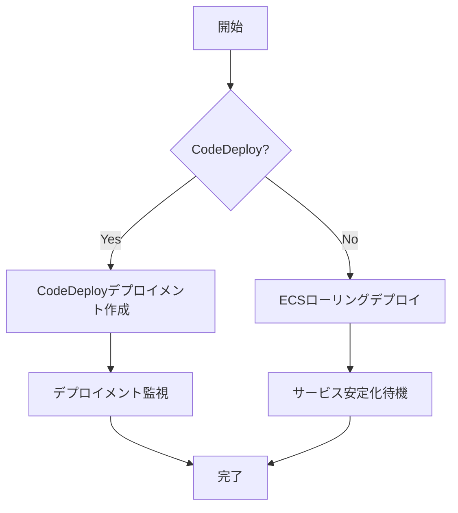

# deploy

`deploy`コマンドは、ECSサービスをデプロイするために使用します。

## 基本的な使い方

```bash
ecspresso deploy [オプション]
```

## オプション

| オプション | 説明 | デフォルト値 |
|------------|------|------------|
| `--dry-run` | ドライラン（変更は適用されない） | false |
| `--tasks N` | デザイアカウント（タスク数）を指定 | 現在の値を維持 |
| `--skip-task-definition` | タスク定義の登録をスキップ | false |
| `--force-new-deployment` | 強制的に新しいデプロイを実行 | false |
| `--wait` | サービスが安定するまで待機 | true |
| `--wait-until` | 待機条件を指定（stable または deployed） | stable |
| `--suspend-auto-scaling` | オートスケーリングを一時停止 | - |
| `--resume-auto-scaling` | オートスケーリングを再開 | - |
| `--auto-scaling-min` | オートスケーリングの最小キャパシティを設定 | - |
| `--auto-scaling-max` | オートスケーリングの最大キャパシティを設定 | - |
| `--rollback-events` | 指定イベント発生時に自動ロールバック（CodeDeployのみ） | - |
| `--no-update-service` | サービス定義の更新をスキップ | false |
| `--latest-task-definition` | 最新のタスク定義を使用 | false |

## 使用例

### 基本的なデプロイ

```bash
ecspresso deploy
```

### ドライランでの確認

```bash
ecspresso deploy --dry-run
```

### タスク数を指定してデプロイ

```bash
ecspresso deploy --tasks 5
```

### タスク定義の更新をスキップ（サービス設定のみ更新）

```bash
ecspresso deploy --skip-task-definition
```

### 強制的に新しいデプロイを実行

```bash
ecspresso deploy --force-new-deployment
```

### オートスケーリング設定を変更してデプロイ

```bash
ecspresso deploy --auto-scaling-min 2 --auto-scaling-max 10
```

### CodeDeployでのデプロイと自動ロールバック設定

```bash
ecspresso deploy --rollback-events DEPLOYMENT_FAILURE
```

## 詳細

`deploy`コマンドは以下の処理を行います：

1. タスク定義の登録（`--skip-task-definition`が指定されていない場合）
2. サービス定義の更新（`--no-update-service`が指定されていない場合）
3. サービスのデプロイ
4. サービスが安定するまで待機（`--wait`が指定されている場合）

CodeDeployを使用している場合は、ブルー/グリーンデプロイメントが実行されます。

## デプロイフロー


