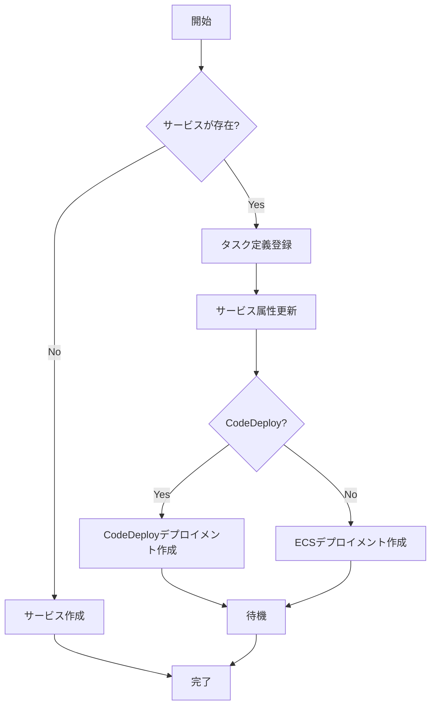

# デプロイ関連コマンド

## deploy

ECSサービスをデプロイします。新しいタスク定義を登録し、サービスを更新します。

```
Usage: ecspresso deploy [flags]

Flags:
  --dry-run                  ドライラン（実際の変更は行わない）
  --tasks=N                  タスクの希望数（-1で現在の値を維持）
  --skip-task-definition     新しいタスク定義の登録をスキップ
  --revision=N               --skip-task-definitionを指定時に使用するリビジョン番号
  --force-new-deployment     サービスの新しいデプロイを強制的に行う
  --[no-]wait                サービスが安定するまで待機（デフォルト：true）
  --wait-until=CONDITION     待機条件（stable:安定、deployed:デプロイ完了）（デフォルト：stable）
  --suspend-auto-scaling     ECSサービスに付加されたAuto Scalingを一時停止
  --resume-auto-scaling      ECSサービスに付加されたAuto Scalingを再開
  --auto-scaling-min=N       ECSサービスに付加されたAuto Scalingの最小容量を設定
  --auto-scaling-max=N       ECSサービスに付加されたAuto Scalingの最大容量を設定
  --rollback-events=EVENTS   指定イベント発生時にロールバック（CodeDeployのみ）
  --[no-]update-service      サービス定義によるサービス属性の更新（デフォルト：true）
  --latest-task-definition   新しいタスク定義を登録せずに最新のタスク定義でデプロイ
```

### 例

基本的なデプロイ：
```console
$ ecspresso deploy
```

特定のタスク数でデプロイ：
```console
$ ecspresso deploy --tasks=10
```

Auto Scaling設定を変更してデプロイ：
```console
$ ecspresso deploy --resume-auto-scaling --auto-scaling-min=2 --auto-scaling-max=20
```

### デプロイフロー



## rollback

サービスを以前のタスク定義にロールバックします。

```
Usage: ecspresso rollback [flags]

Flags:
  --dry-run                  ドライラン（実際の変更は行わない）
  --tasks=N                  タスクの希望数（-1で現在の値を維持）
  --deregister               ロールバック後に現在のタスク定義を登録解除
  --[no-]wait                サービスが安定するまで待機（デフォルト：true）
  --wait-until=CONDITION     待機条件（stable:安定、deployed:デプロイ完了）（デフォルト：stable）
  --task-definition-only     タスク定義のみをロールバック（サービスを更新しない）
```

### 例

基本的なロールバック：
```console
$ ecspresso rollback
```

タスク定義のみをロールバック：
```console
$ ecspresso rollback --task-definition-only
```

## refresh

サービスを更新せずに新しいデプロイメントを強制します。`deploy --skip-task-definition --force-new-deployment --no-update-service`と同等です。

```
Usage: ecspresso refresh [flags]

Flags:
  --dry-run                  ドライラン（実際の変更は行わない）
  --tasks=N                  タスクの希望数（-1で現在の値を維持）
  --[no-]wait                サービスが安定するまで待機（デフォルト：true）
  --wait-until=CONDITION     待機条件（stable:安定、deployed:デプロイ完了）（デフォルト：stable）
```

### 例

フォースデプロイメント：
```console
$ ecspresso refresh
```

## scale

サービスのタスク数を変更します。`deploy --skip-task-definition --no-update-service`と同等です。

```
Usage: ecspresso scale [flags]

Flags:
  --dry-run                  ドライラン（実際の変更は行わない）
  --tasks=N                  タスクの希望数（必須）
  --[no-]wait                サービスが安定するまで待機（デフォルト：true）
  --wait-until=CONDITION     待機条件（stable:安定、deployed:デプロイ完了）（デフォルト：stable）
```

### 例

タスク数を10に設定：
```console
$ ecspresso scale --tasks=10
```
