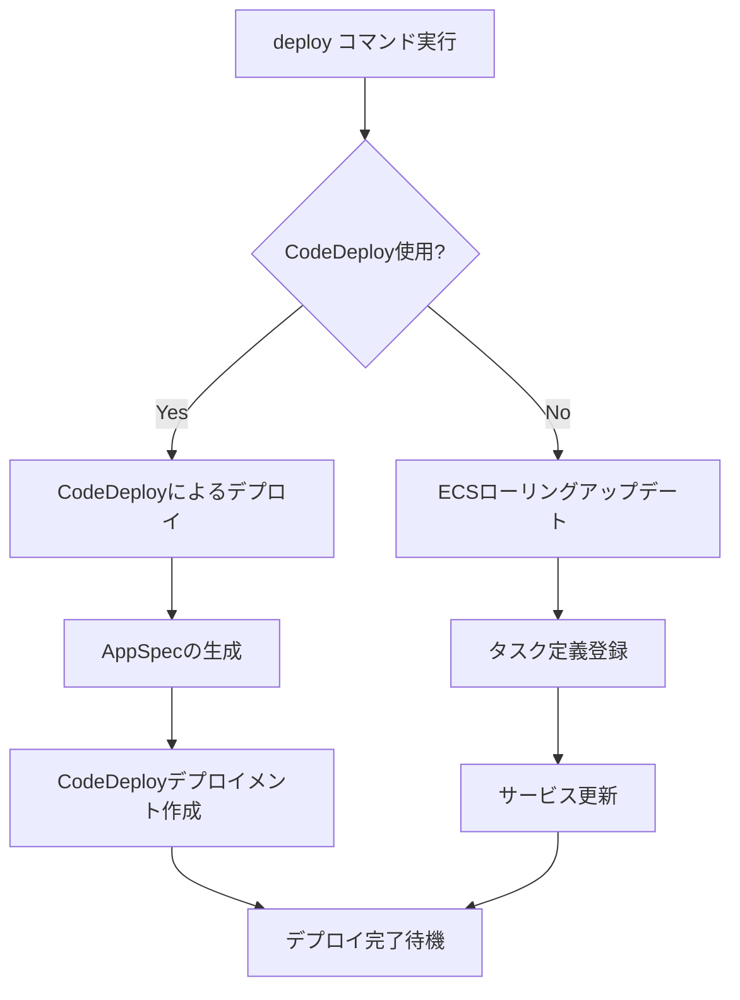

# deploy

`deploy`コマンドは、ECSサービスをデプロイします。タスク定義の登録、サービスの更新、デプロイの監視を行います。

## 基本的な使い方

```bash
ecspresso deploy
```

## オプション

| オプション | 説明 | デフォルト値 |
|------------|------|------------|
| `--dry-run` | 実際の変更を行わずに実行 | `false` |
| `--tasks` | タスクの希望数 | 現在の値を維持 |
| `--skip-task-definition` | 新しいタスク定義の登録をスキップ | `false` |
| `--revision` | `--skip-task-definition`使用時に実行するタスク定義のリビジョン | `0` |
| `--force-new-deployment` | サービスの強制再デプロイ | `false` |
| `--wait` | サービスが安定するまで待機 | `true` |
| `--no-wait` | サービスが安定するまで待機しない | - |
| `--wait-until` | 待機条件（stable/deployed） | `stable` |
| `--suspend-auto-scaling` | サービスに関連付けられたAuto Scalingを一時停止 | - |
| `--resume-auto-scaling` | サービスに関連付けられたAuto Scalingを再開 | - |
| `--auto-scaling-min` | Auto Scalingの最小容量を設定 | - |
| `--auto-scaling-max` | Auto Scalingの最大容量を設定 | - |
| `--rollback-events` | 指定されたイベント発生時にロールバック（CodeDeployのみ） | - |
| `--update-service` | サービス定義によるサービス属性の更新 | `true` |
| `--no-update-service` | サービス属性を更新しない | - |
| `--latest-task-definition` | 新しいタスク定義を登録せずに最新のタスク定義を使用 | `false` |

## デプロイプロセス

`deploy`コマンドは以下のステップを実行します：

1. サービスの現在の状態を取得
2. 新しいタスク定義を登録（`--skip-task-definition`が指定されていない場合）
3. サービス属性を更新（`--update-service`が指定されている場合）
4. サービスのタスク数を更新（`--tasks`が指定されている場合）
5. デプロイの完了を待機（`--wait`が指定されている場合）

## デプロイ方法

ecspressoは、サービスの設定に応じて2つのデプロイ方法をサポートしています：

1. **ECSローリングアップデート** - デフォルトのデプロイ方法
2. **CodeDeployによるブルー/グリーンデプロイメント** - `deploymentController.type`が`CODE_DEPLOY`に設定されている場合



## Auto Scalingの管理

`deploy`コマンドでは、Application Auto Scalingの設定も管理できます：

- `--suspend-auto-scaling` - デプロイ中にAuto Scalingを一時停止
- `--resume-auto-scaling` - デプロイ後にAuto Scalingを再開
- `--auto-scaling-min` - 最小容量を設定
- `--auto-scaling-max` - 最大容量を設定

## CodeDeployによるロールバック

CodeDeployを使用している場合、`--rollback-events`オプションを使用して自動ロールバックを設定できます：

```bash
ecspresso deploy --rollback-events DEPLOYMENT_FAILURE,DEPLOYMENT_STOP_ON_ALARM
```

サポートされているイベントタイプ：
- `DEPLOYMENT_FAILURE` - デプロイ失敗時
- `DEPLOYMENT_STOP_ON_ALARM` - アラーム発生時
- `DEPLOYMENT_STOP_ON_REQUEST` - 手動停止時

## 使用例

### 基本的なデプロイ

```bash
ecspresso deploy
```

### タスク数を指定してデプロイ

```bash
ecspresso deploy --tasks=5
```

### 強制的に再デプロイ

```bash
ecspresso deploy --force-new-deployment
```

### タスク定義の更新なしでデプロイ

```bash
ecspresso deploy --skip-task-definition
```

### 特定のリビジョンのタスク定義を使用

```bash
ecspresso deploy --skip-task-definition --revision=10
```

### Auto Scalingを管理しながらデプロイ

```bash
ecspresso deploy --resume-auto-scaling --auto-scaling-min=2 --auto-scaling-max=10
```

### ドライランモードでデプロイ

```bash
ecspresso deploy --dry-run
```

### CodeDeployによるデプロイとロールバック設定

```bash
ecspresso deploy --rollback-events=DEPLOYMENT_FAILURE
```

## refresh コマンド {#refresh}

`refresh`コマンドは、`deploy`コマンドのショートカットで、以下のオプションを指定した場合と同等です：

```bash
ecspresso deploy --skip-task-definition --force-new-deployment --no-update-service
```

使用例：

```bash
ecspresso refresh
```

## scale コマンド {#scale}

`scale`コマンドは、`deploy`コマンドのショートカットで、サービスのタスク数を変更する場合に使用します：

```bash
ecspresso scale --tasks=5
```

これは以下のコマンドと同等です：

```bash
ecspresso deploy --skip-task-definition --no-update-service --tasks=5
```

## 注意事項

- `--tasks`オプションで`-1`を指定すると、現在の希望数を維持します。
- スケジューリング戦略が`DAEMON`の場合、`--tasks`オプションは無視されます。
- CodeDeployを使用している場合、一部のサービス属性は更新できません（ネットワーク設定、プラットフォームバージョンなど）。
- `--wait-until`オプションで`stable`を指定すると、サービスが安定状態になるまで待機します。`deployed`を指定すると、デプロイメントが完了するまで待機します。
