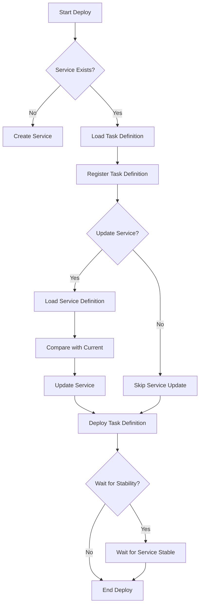

# Deployment Commands

## deploy

The `deploy` command updates an ECS service with a new task definition and/or updated service attributes.

```shell
ecspresso deploy
```

### Deployment Flow



### Options

| Option | Description | Default |
|--------|-------------|---------|
| `--dry-run` | Dry run (no changes to AWS) | `false` |
| `--tasks` | Desired count of tasks | (current count) |
| `--skip-task-definition` | Skip register a new task definition | `false` |
| `--force-new-deployment` | Force a new deployment | `false` |
| `--no-wait` | Don't wait for service stable | `false` |
| `--wait-until` | Wait until service stable or deployed | `stable` |
| `--suspend-auto-scaling` | Suspend application auto-scaling | - |
| `--resume-auto-scaling` | Resume application auto-scaling | - |
| `--rollback-events` | Roll back when specified events happen | - |
| `--no-update-service` | Don't update service attributes | `false` |
| `--latest-task-definition` | Use the latest task definition | `false` |

## rollback

The `rollback` command rolls back a service to a previous task definition.

```shell
ecspresso rollback --revision=3
```

### Options

| Option | Description | Default |
|--------|-------------|---------|
| `--dry-run` | Dry run (no changes to AWS) | `false` |
| `--tasks` | Desired count of tasks | (current count) |
| `--deregister` | Deregister rolled back task definition | `false` |
| `--wait` | Wait for service stable | `true` |
| `--revision` | Revision of the task definition to rollback | - |

## refresh

The `refresh` command forces a new deployment of the service without changing the task definition or service attributes. Equivalent to `deploy --skip-task-definition --force-new-deployment --no-update-service`.

```shell
ecspresso refresh
```

## scale

The `scale` command changes the desired count of the service. Equivalent to `deploy --skip-task-definition --no-update-service`.

```shell
ecspresso scale --tasks=10
```
