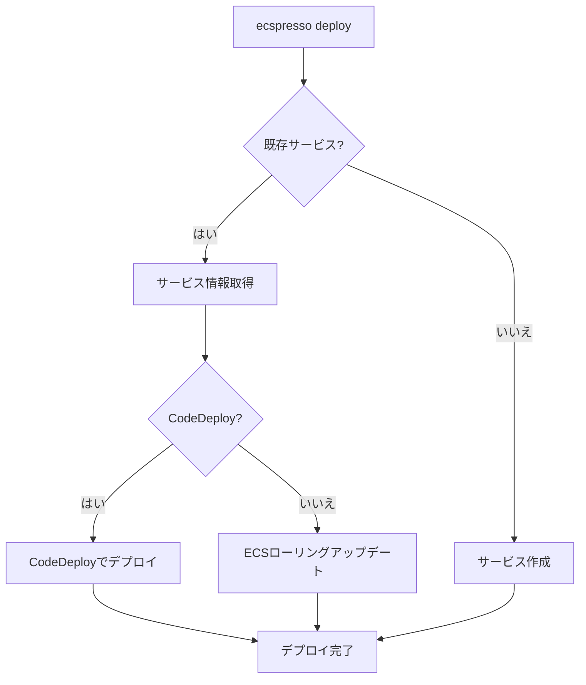

# deploy

`deploy`コマンドは、ECSサービスをデプロイするために使用します。新しいタスク定義を登録し、サービスを更新します。

## 使用方法

```
ecspresso deploy [オプション]
```

## オプション

| オプション | 説明 | デフォルト値 |
|------------|------|--------------|
| `--dry-run` | 実際の変更を行わずに、変更内容を表示します | `false` |
| `--tasks=TASKS` | タスクの希望数を設定します | 現在の設定値 |
| `--skip-task-definition` | 新しいタスク定義の登録をスキップします | `false` |
| `--revision=N` | `--skip-task-definition`使用時に実行するタスク定義のリビジョン番号 | `0` |
| `--force-new-deployment` | サービスの新しいデプロイメントを強制します | `false` |
| `--[no-]wait` | サービスの安定を待ちます | `true` |
| `--wait-until=STATE` | サービスの待機状態を選択します (stable,deployed) | `stable` |
| `--suspend-auto-scaling=BOOL` | サービスに接続されたオートスケーリングを一時停止します | - |
| `--resume-auto-scaling=BOOL` | サービスに接続されたオートスケーリングを再開します | - |
| `--auto-scaling-min=N` | オートスケーリングの最小容量を設定します | - |
| `--auto-scaling-max=N` | オートスケーリングの最大容量を設定します | - |
| `--rollback-events=EVENTS` | 指定されたイベント発生時にロールバックします (DEPLOYMENT_FAILURE,DEPLOYMENT_STOP_ON_ALARM,DEPLOYMENT_STOP_ON_REQUEST) | - |
| `--[no-]update-service` | サービス定義によってサービス属性を更新します | `true` |
| `--latest-task-definition` | 新しいタスク定義を登録せずに最新のタスク定義でデプロイします | `false` |

## 使用例

基本的なデプロイ:
```bash
$ ecspresso deploy
```

タスク数を変更してデプロイ:
```bash
$ ecspresso deploy --tasks=5
```

タスク定義を更新せずにサービス設定のみを更新:
```bash
$ ecspresso deploy --skip-task-definition
```

サービスの強制再デプロイ:
```bash
$ ecspresso deploy --force-new-deployment
```

CodeDeployを使用したロールバック設定付きデプロイ:
```bash
$ ecspresso deploy --rollback-events=DEPLOYMENT_FAILURE
```

## デプロイの流れ


