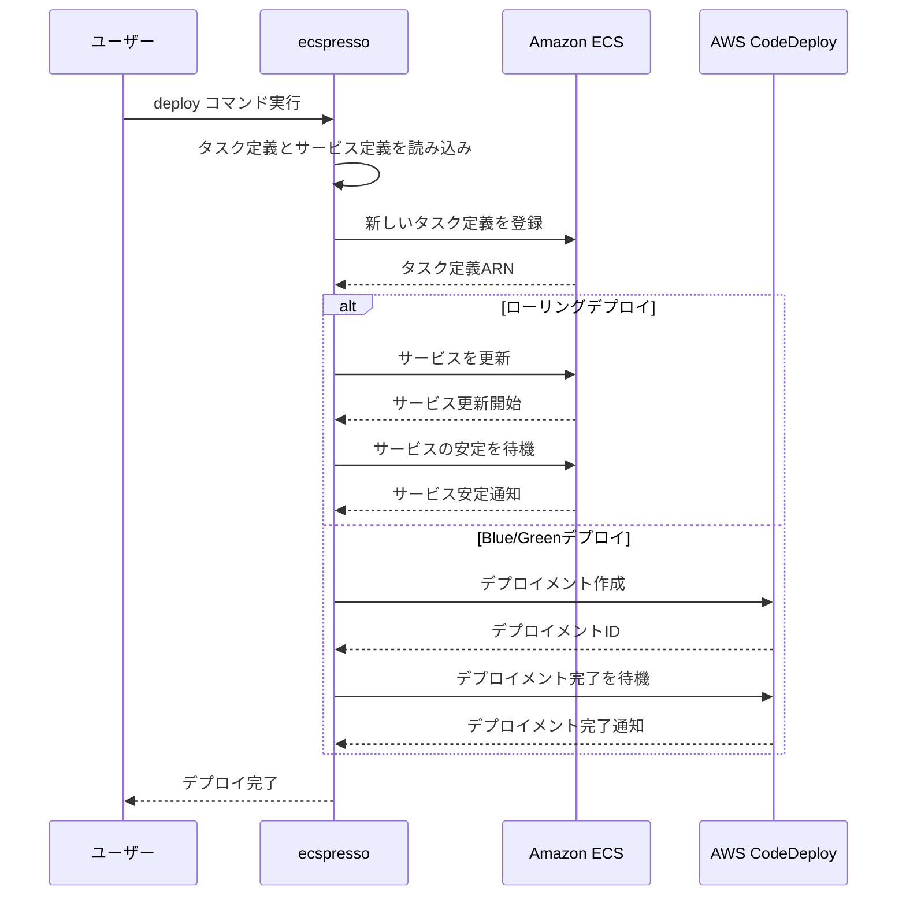

# deploy

`deploy`コマンドは、ECSサービスをデプロイします。これはecspressoの最も基本的なコマンドです。

## 使い方

```console
$ ecspresso deploy --config ecspresso.yml
```

## オプション

| オプション | 説明 |
|------------|------|
| `--config` | 設定ファイルのパス（デフォルト: ecspresso.yml） |
| `--task-definition` | タスク定義のJSONファイルパス |
| `--service-definition` | サービス定義のJSONファイルパス |
| `--skip-task-definition` | タスク定義の更新をスキップ |
| `--update-service` | サービスの更新を行う（デフォルト: true） |
| `--no-update-service` | サービスの更新を行わない |
| `--force-new-deployment` | 強制的に新しいデプロイメントを作成 |
| `--wait-until-stable` | サービスが安定するまで待機（デフォルト: true） |
| `--no-wait-until-stable` | サービスが安定するまで待機しない |
| `--suspend-auto-scaling` | Auto Scalingを一時停止 |
| `--resume-auto-scaling` | Auto Scalingを再開 |
| `--rollback-events` | 指定されたイベントが発生した場合にロールバックする（例: DEPLOYMENT_FAILURE） |
| `--tasks` | サービスのタスク数を指定 |
| `--auto-scaling-min` | Auto Scalingの最小値を設定 |
| `--auto-scaling-max` | Auto Scalingの最大値を設定 |
| `--revision` | 使用するタスク定義のリビジョン |
| `--latest-task-definition` | 最新のタスク定義を使用 |
| `--dry-run` | 実際にデプロイを行わずに実行内容を表示 |

## 使用例

### 基本的なデプロイ

```console
$ ecspresso deploy --config ecspresso.yml
```

### タスク定義の更新をスキップしてサービスを更新

```console
$ ecspresso deploy --config ecspresso.yml --skip-task-definition
```

### 強制的に新しいデプロイメントを作成

```console
$ ecspresso deploy --config ecspresso.yml --force-new-deployment
```

### デプロイ失敗時に自動的にロールバック

```console
$ ecspresso deploy --config ecspresso.yml --rollback-events DEPLOYMENT_FAILURE
```

### タスク数を変更してデプロイ

```console
$ ecspresso deploy --config ecspresso.yml --tasks 10
```

### Auto Scalingの設定を変更してデプロイ

```console
$ ecspresso deploy --config ecspresso.yml --auto-scaling-min 5 --auto-scaling-max 20
```

## デプロイフロー


