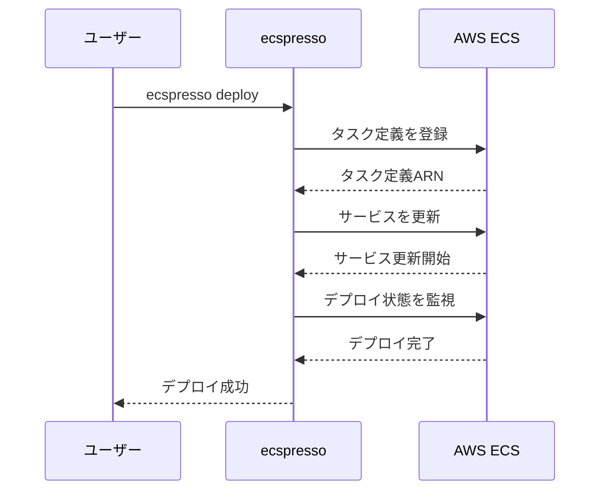

# デプロイ関連コマンド

ecspressoのデプロイに関連するコマンドを説明します。

## deploy

`deploy`コマンドは、タスク定義を登録し、ECSサービスを更新します。

```console
$ ecspresso deploy [オプション]
```

### 主なオプション

| オプション | 説明 |
|------------|------|
| `--dry-run` | 実際にデプロイせず、変更内容を表示します |
| `--tasks N` | デプロイ時のタスク数を指定します |
| `--skip-task-definition` | タスク定義の更新をスキップします |
| `--update-service` | サービス定義の更新を行います |
| `--force-new-deployment` | 強制的に新しいデプロイを開始します |
| `--no-wait` | デプロイ完了を待たずに終了します |
| `--blue-green` | Blue/Greenデプロイを実行します |

### 使用例

標準的なデプロイ：
```console
$ ecspresso deploy
```

Blue/Greenデプロイ：
```console
$ ecspresso deploy --blue-green
```

サービス定義の更新のみ：
```console
$ ecspresso deploy --skip-task-definition --update-service
```

## rollback

`rollback`コマンドは、以前のタスク定義にロールバックします。

```console
$ ecspresso rollback [オプション]
```

### 主なオプション

| オプション | 説明 |
|------------|------|
| `--dry-run` | 実際にロールバックせず、変更内容を表示します |
| `--deregister-task-definition` | ロールバック後に現在のタスク定義を登録解除します |
| `--no-wait` | ロールバック完了を待たずに終了します |

### 使用例

```console
$ ecspresso rollback
```

## run

`run`コマンドは、タスク定義に基づいて一時的なタスクを実行します。

```console
$ ecspresso run [オプション]
```

### 主なオプション

| オプション | 説明 |
|------------|------|
| `--dry-run` | 実際にタスクを実行せず、設定内容を表示します |
| `--count N` | 実行するタスクの数を指定します |
| `--overrides string` | タスク定義のオーバーライドをJSON形式で指定します |
| `--skip-task-definition` | 新しいタスク定義の登録をスキップします |
| `--launch-type string` | 起動タイプを指定します（EC2またはFARGATE） |

### 使用例

```console
$ ecspresso run
```

環境変数をオーバーライドして実行：
```console
$ ecspresso run --overrides '{"containerOverrides":[{"name":"app","environment":[{"name":"DEBUG","value":"1"}]}]}'
```

## デプロイフロー図

以下はデプロイコマンドのフロー図です：


