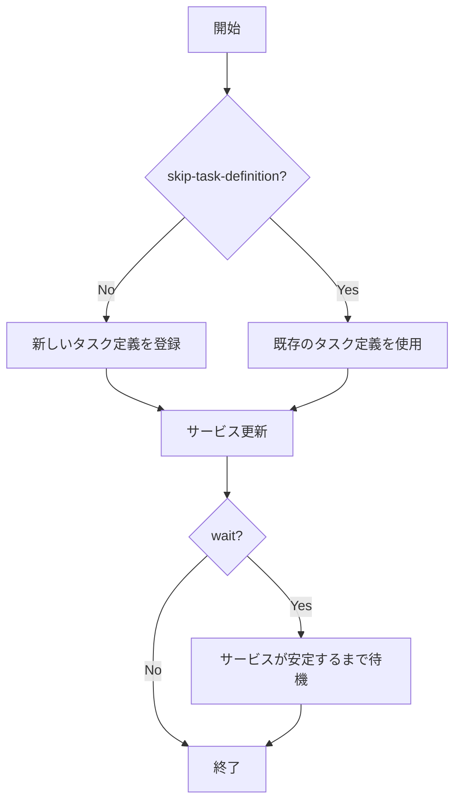

# デプロイ関連コマンド

## deploy

`deploy`コマンドは、タスク定義を登録し、ECSサービスを更新します。

```
Usage: ecspresso deploy [options]

Options:
  --dry-run                       ドライラン（実際には変更を行わない）
  --tasks=N                       タスクの希望数 (-1: 変更なし)
  --skip-task-definition          新しいタスク定義の登録をスキップ
  --revision=N                    --skip-task-definitionと共に使用する場合のタスク定義リビジョン
  --force-new-deployment          サービスの新しいデプロイを強制
  --[no-]wait                     サービスが安定するまで待機 (デフォルト: true)
  --wait-until=STATE              サービスが安定するまで待機するか、デプロイが完了するまで待機するかを選択 (stable|deployed)
  --suspend-auto-scaling          ECSサービスに関連付けられたアプリケーションのオートスケーリングを一時停止
  --resume-auto-scaling           ECSサービスに関連付けられたアプリケーションのオートスケーリングを再開
  --autoscaling-min=N             ECSサービスに関連付けられたアプリケーションのオートスケーリングの最小容量を設定
  --autoscaling-max=N             ECSサービスに関連付けられたアプリケーションのオートスケーリングの最大容量を設定
  --rollback-events=EVENTS        指定されたイベントが発生した場合にロールバック (DEPLOYMENT_FAILURE,DEPLOYMENT_STOP_ON_ALARM,DEPLOYMENT_STOP_ON_REQUEST,...)
  --[no-]update-service           サービス定義によるサービス属性の更新 (デフォルト: true)
  --latest-task-definition        新しいタスク定義を登録せずに最新のタスク定義でデプロイ
```

### 使用例

```console
# 基本的なデプロイ
$ ecspresso deploy

# タスク数を5に変更してデプロイ
$ ecspresso deploy --tasks=5

# 新しいデプロイを強制（同じタスク定義でも再デプロイ）
$ ecspresso deploy --force-new-deployment

# タスク定義の登録をスキップしてサービス設定のみ更新
$ ecspresso deploy --skip-task-definition

# デプロイ後にサービスが安定するまで待機しない
$ ecspresso deploy --no-wait
```

### デプロイフロー



## refresh

`refresh`コマンドは、新しいタスク定義を登録せずに、サービスの新しいデプロイを強制します。`deploy --skip-task-definition --force-new-deployment --no-update-service`と同等です。

```
Usage: ecspresso refresh [options]

Options:
  --dry-run                       ドライラン（実際には変更を行わない）
  --[no-]wait                     サービスが安定するまで待機 (デフォルト: true)
```

### 使用例

```console
# サービスをリフレッシュ
$ ecspresso refresh

# ドライランでリフレッシュ（実際には変更を行わない）
$ ecspresso refresh --dry-run
```

## rollback

`rollback`コマンドは、サービスを以前のタスク定義にロールバックします。

```
Usage: ecspresso rollback [options]

Options:
  --dry-run                       ドライラン（実際には変更を行わない）
  --tasks=N                       タスクの希望数 (-1: 変更なし)
  --deregister-task-definition    ロールバック後に現在のタスク定義を登録解除
  --[no-]wait                     サービスが安定するまで待機 (デフォルト: true)
```

### 使用例

```console
# 前のタスク定義にロールバック
$ ecspresso rollback

# ロールバック後に現在のタスク定義を登録解除
$ ecspresso rollback --deregister-task-definition
```

## scale

`scale`コマンドは、サービスのタスク数を変更します。`deploy --skip-task-definition --no-update-service`と同等です。

```
Usage: ecspresso scale [options]

Options:
  --dry-run                       ドライラン（実際には変更を行わない）
  --tasks=N                       タスクの希望数 (-1: 変更なし)
  --[no-]wait                     サービスが安定するまで待機 (デフォルト: true)
```

### 使用例

```console
# タスク数を5に変更
$ ecspresso scale --tasks=5

# ドライランでスケール（実際には変更を行わない）
$ ecspresso scale --tasks=10 --dry-run
```

## wait

`wait`コマンドは、サービスが安定するまで待機します。

```
Usage: ecspresso wait [options]

Options:
  --timeout=DURATION              タイムアウト時間
```

### 使用例

```console
# サービスが安定するまで待機
$ ecspresso wait

# 5分のタイムアウトでサービスが安定するまで待機
$ ecspresso wait --timeout=5m
```
