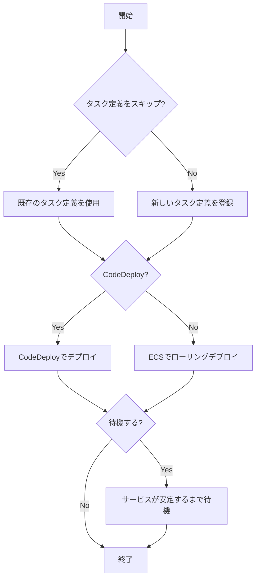

# デプロイ関連コマンド

## deploy

`deploy`コマンドは、タスク定義を登録し、ECSサービスを更新します。

```
ecspresso deploy [オプション]
```

### オプション

| オプション | 説明 | デフォルト |
|----------|------|----------|
| `--dry-run` | 実際の変更を行わずに動作確認 | false |
| `--tasks N` | タスクの希望数 | -1（変更なし） |
| `--skip-task-definition` | 新しいタスク定義の登録をスキップ | false |
| `--revision N` | `--skip-task-definition`使用時に実行するタスク定義のリビジョン | 0 |
| `--force-new-deployment` | サービスの強制的な新規デプロイメント | false |
| `--no-wait` | サービスが安定するまで待機しない | false |
| `--wait-until STRING` | `stable`（サービスが安定するまで）または`deployed`（デプロイメントが完了するまで）のどちらを待機するか | stable |
| `--suspend-auto-scaling` | ECSサービスに関連付けられた自動スケーリングを一時停止 | - |
| `--resume-auto-scaling` | ECSサービスに関連付けられた自動スケーリングを再開 | - |
| `--auto-scaling-min N` | ECSサービスに関連付けられた自動スケーリングの最小容量を設定 | - |
| `--auto-scaling-max N` | ECSサービスに関連付けられた自動スケーリングの最大容量を設定 | - |
| `--rollback-events STRING` | 指定されたイベントが発生した場合にロールバック（DEPLOYMENT_FAILURE,DEPLOYMENT_STOP_ON_ALARMなど）。CodeDeployのみ | - |
| `--no-update-service` | サービス定義によるサービス属性の更新を行わない | false |
| `--latest-task-definition` | 新しいタスク定義を登録せずに最新のタスク定義でデプロイ | false |

### デプロイフロー



## rollback

`rollback`コマンドは、サービスを以前のタスク定義にロールバックします。

```
ecspresso rollback [オプション]
```

### オプション

| オプション | 説明 | デフォルト |
|----------|------|----------|
| `--dry-run` | 実際の変更を行わずに動作確認 | false |
| `--tasks N` | タスクの希望数 | -1（変更なし） |
| `--deregister` | ロールバック後に現在のタスク定義を登録解除 | false |
| `--wait` | サービスが安定するまで待機 | true |
| `--wait-until STRING` | `stable`（サービスが安定するまで）または`deployed`（デプロイメントが完了するまで）のどちらを待機するか | stable |

## refresh

`refresh`コマンドは、サービスを更新（リフレッシュ）します。新しいタスク定義は登録せず、強制的に新規デプロイメントを行います。

```
ecspresso refresh [オプション]
```

### オプション

| オプション | 説明 | デフォルト |
|----------|------|----------|
| `--dry-run` | 実際の変更を行わずに動作確認 | false |
| `--wait` | サービスが安定するまで待機 | true |

## scale

`scale`コマンドは、サービスのタスク数を変更します。

```
ecspresso scale --tasks N [オプション]
```

### オプション

| オプション | 説明 | デフォルト |
|----------|------|----------|
| `--dry-run` | 実際の変更を行わずに動作確認 | false |
| `--tasks N` | 必須：タスクの希望数 | - |
| `--wait` | サービスが安定するまで待機 | true |
| `--auto-scaling-min N` | 自動スケーリングの最小容量を設定 | - |
| `--auto-scaling-max N` | 自動スケーリングの最大容量を設定 | - |
| `--suspend-auto-scaling` | 自動スケーリングを一時停止 | - |
| `--resume-auto-scaling` | 自動スケーリングを再開 | - |

ecspressoのデプロイに関連するコマンドを説明します。

## deploy

`deploy`コマンドは、タスク定義を登録し、ECSサービスを更新します。v2では、`create`コマンドが廃止され、`deploy`コマンドでサービスの作成も可能になりました。

```console
$ ecspresso deploy [オプション]
```

### 主なオプション

| オプション | 説明 |
|------------|------|
| `--dry-run` | 実際にデプロイせず、変更内容を表示します |
| `--tasks N` | デプロイ時のタスク数を指定します |
| `--skip-task-definition` | タスク定義の更新をスキップします |
| `--update-service` | サービス定義の更新を行います |
| `--force-new-deployment` | 強制的に新しいデプロイを開始します |
| `--no-wait` | デプロイ完了を待たずに終了します |
| `--blue-green` | Blue/Greenデプロイを実行します |
| `--revision` | 使用するタスク定義のリビジョンを指定します |
| `--wait-until` | デプロイの待機条件を指定します（`service_stable`または`service_deployment_completed`） |

### 使用例

標準的なデプロイ：
```console
$ ecspresso deploy
```

Blue/Greenデプロイ：
```console
$ ecspresso deploy --blue-green
```

サービス定義の更新のみ：
```console
$ ecspresso deploy --skip-task-definition --update-service
```

特定のリビジョンを使用したデプロイ：
```console
$ ecspresso deploy --revision 10
```

デプロイメント完了まで待機（サービス安定化を待たない）：
```console
$ ecspresso deploy --wait-until service_deployment_completed
```

## rollback

`rollback`コマンドは、以前のタスク定義にロールバックします。v2では、`--deregister-task-definition`オプションがデフォルトで有効になりました。

```console
$ ecspresso rollback [オプション]
```

### 主なオプション

| オプション | 説明 |
|------------|------|
| `--dry-run` | 実際にロールバックせず、変更内容を表示します |
| `--deregister-task-definition` | ロールバック後に現在のタスク定義を登録解除します（v2ではデフォルトでtrue） |
| `--no-wait` | ロールバック完了を待たずに終了します |
| `--wait-until` | ロールバックの待機条件を指定します（`service_stable`または`service_deployment_completed`） |

### 使用例

```console
$ ecspresso rollback
```

タスク定義の登録解除をスキップ：
```console
$ ecspresso rollback --deregister-task-definition=false
```

## run

`run`コマンドは、タスク定義に基づいて一時的なタスクを実行します。

```console
$ ecspresso run [オプション]
```

### 主なオプション

| オプション | 説明 |
|------------|------|
| `--dry-run` | 実際にタスクを実行せず、設定内容を表示します |
| `--count N` | 実行するタスクの数を指定します |
| `--overrides string` | タスク定義のオーバーライドをJSON形式で指定します |
| `--skip-task-definition` | 新しいタスク定義の登録をスキップします |
| `--launch-type string` | 起動タイプを指定します（EC2またはFARGATE） |
| `--revision` | 使用するタスク定義のリビジョンを指定します |
| `--latest-task-definition` | 最新のタスク定義を使用します（`--revision`と排他的） |
| `--client-token` | クライアントトークンを指定して重複実行を防止します |
| `--watch-container` | 指定したコンテナの出力を監視します |

### 使用例

```console
$ ecspresso run
```

環境変数をオーバーライドして実行：
```console
$ ecspresso run --overrides '{"containerOverrides":[{"name":"app","environment":[{"name":"DEBUG","value":"1"}]}]}'
```

特定のリビジョンを使用して実行：
```console
$ ecspresso run --revision 10
```

クライアントトークンを指定して実行：
```console
$ ecspresso run --client-token unique-token-123
```

コンテナの出力を監視：
```console
$ ecspresso run --watch-container app
```

## デプロイフロー図

以下はデプロイコマンドのフロー図です：


## CodeDeployの設定

v2では、設定ファイルでCodeDeployのアプリケーション名とデプロイメントグループ名、デプロイメント設定名を指定できるようになりました。

```yaml
# ecspresso.yml
region: ap-northeast-1
cluster: my-cluster
service: my-service
service_definition: ecs-service-def.json
task_definition: ecs-task-def.json
timeout: 10m
code_deploy:
  application_name: AppECS-my-cluster-my-service
  deployment_group_name: DgpECS-my-cluster-my-service
  deployment_config_name: CodeDeployDefault.ECSAllAtOnce
```

AppSpecファイルはYAMLまたはJSON形式で指定できます：

```yaml
# appspec.yaml
version: 0.0
Resources:
  - TargetService:
      Type: AWS::ECS::Service
      Properties:
        TaskDefinition: <TASK_DEFINITION>
        LoadBalancerInfo:
          ContainerName: "app"
          ContainerPort: 80
```

または

```json
{
  "version": 0.0,
  "Resources": [
    {
      "TargetService": {
        "Type": "AWS::ECS::Service",
        "Properties": {
          "TaskDefinition": "<TASK_DEFINITION>",
          "LoadBalancerInfo": {
            "ContainerName": "app",
            "ContainerPort": 80
          }
        }
      }
    }
  ]
}
```
