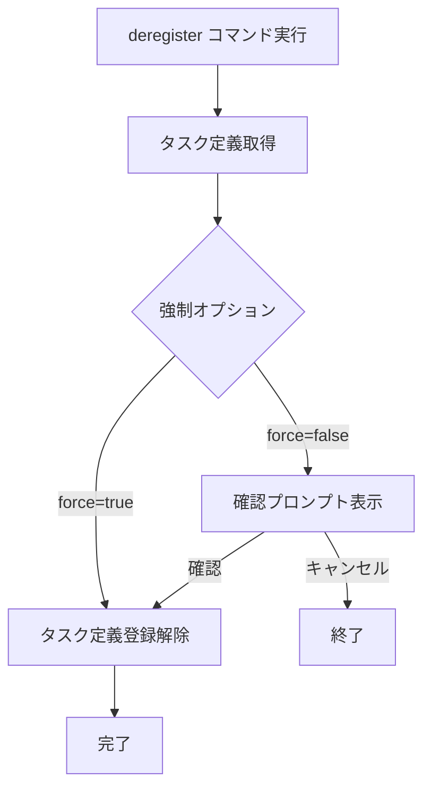

# deregister

`deregister`コマンドは、ECSタスク定義を登録解除します。使用されていないタスク定義を整理する際に役立ちます。

## 基本的な使い方

```bash
ecspresso deregister --revision=3
```

## オプション

| オプション | 説明 | デフォルト値 |
|------------|------|------------|
| `--dry-run` | 実際の変更を行わずに実行 | `false` |
| `--revision` | 登録解除するタスク定義のリビジョン | - |
| `--force` | 確認プロンプトをスキップ | `false` |

## 登録解除プロセス

`deregister`コマンドは以下のステップを実行します：

1. 指定されたリビジョンのタスク定義を取得
2. 確認プロンプトを表示（`--force`が指定されていない場合）
3. タスク定義を登録解除



## 確認プロンプト

`--force`オプションが指定されていない場合、`deregister`コマンドは登録解除前に確認プロンプトを表示します：

```
TaskDefinition: your-task-definition:3
Are you sure to DEREGISTER the task definition? [y/N]
```

`y`または`Y`を入力すると登録解除が実行され、それ以外の入力ではキャンセルされます。

## 使用例

### 基本的な使用方法

```bash
ecspresso deregister --revision=3
```

### 確認プロンプトをスキップして登録解除

```bash
ecspresso deregister --revision=3 --force
```

### ドライランモードで登録解除

```bash
ecspresso deregister --revision=3 --dry-run
```

## 複数のタスク定義を登録解除

複数のタスク定義を登録解除するには、シェルスクリプトと組み合わせて使用することができます：

```bash
# 最新の5つを除くすべてのタスク定義を登録解除
for rev in $(ecspresso revisions | tail -n +6); do
  ecspresso deregister --revision=$rev --force
done
```

## 注意事項

- `--revision`オプションは必須です。
- 指定したリビジョンが存在しない場合は、エラーが発生します。
- アクティブなサービスで使用されているタスク定義は登録解除できません。
- `--dry-run`オプションを使用すると、実際の登録解除は行われず、登録解除されるタスク定義の内容が表示されます。
