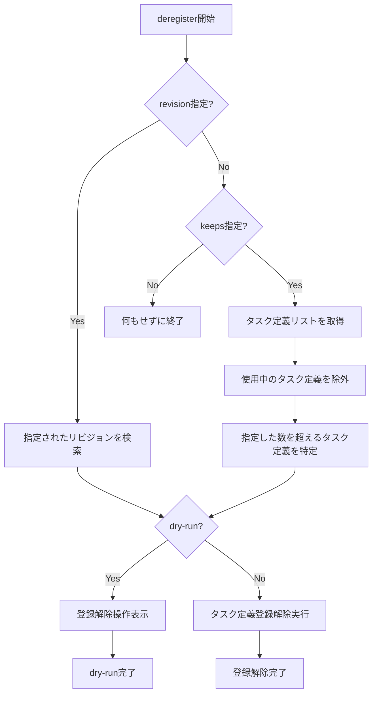

# deregister

`deregister`コマンドは、タスク定義の登録を解除するために使用します。使用されていないタスク定義をクリーンアップしたり、特定のリビジョンのタスク定義を削除したりできます。

## 基本的な使い方

```console
$ ecspresso deregister --config ecspresso.yml --revision 3
```

## オプション

|| オプション | 説明 | デフォルト値 |
|------------|------|-------------|
|| `--dry-run` | 実際に登録解除せずに、実行される操作を表示します | `false` |
|| `--keeps` | 使用中のタスク定義を除いて保持するタスク定義の数 | - |
|| `--revision` | 登録解除するリビジョン番号または'latest' | `""` |

## 使用例

### 特定のリビジョンのタスク定義を登録解除

```console
$ ecspresso deregister --config ecspresso.yml --revision 3
```

### 最新のタスク定義を登録解除

```console
$ ecspresso deregister --config ecspresso.yml --revision latest
```

### ドライランモード

```console
$ ecspresso deregister --config ecspresso.yml --revision 3 --dry-run
```

### 最新の5つのみを残して古いタスク定義を登録解除

```console
$ ecspresso deregister --config ecspresso.yml --keeps 5
```

## 登録解除フロー



## 注意事項

- 現在使用中のタスク定義（アクティブなサービスで使用されているもの）は登録解除できません
- `--keeps`オプションを使用すると、最新のN個のタスク定義を保持し、それ以外の古いタスク定義を登録解除します
- `--revision`と`--keeps`の両方を指定した場合、`--revision`が優先されます
- 登録解除されたタスク定義は、新しいサービスやタスクの作成には使用できなくなります
