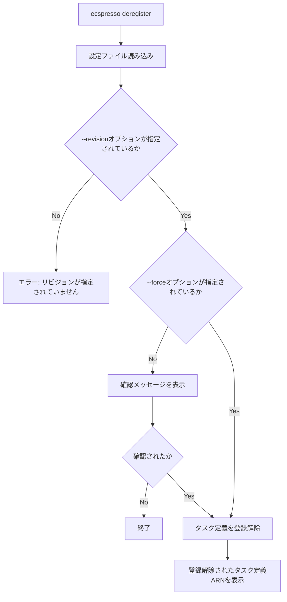

# deregister

`deregister`コマンドは、タスク定義を登録解除します。

## 基本的な使い方

```bash
ecspresso deregister --config CONFIG_FILE --revision REVISION
```

## オプション

| オプション | 説明 | デフォルト値 |
|------------|------|-------------|
| `--config` | 設定ファイルのパス | `ecspresso.yml` |
| `--revision` | 登録解除するタスク定義のリビジョン | - |
| `--force` | 確認なしで登録解除するかどうか | `false` |

## 詳細

`deregister`コマンドは、以下の処理を行います：

1. 設定ファイルからタスク定義情報を読み込む
2. 指定されたリビジョンのタスク定義を登録解除する

このコマンドは、不要になったタスク定義を登録解除するのに役立ちます。

## 登録解除フロー



## 使用例

### 基本的な使用例

```bash
ecspresso deregister --config ecspresso.yml --revision 10
```

### 確認なしで登録解除する例

```bash
ecspresso deregister --config ecspresso.yml --revision 10 --force
```

## タスク定義のリビジョン

タスク定義のリビジョンは、タスク定義のバージョンを表す番号です。例えば、タスク定義ファミリー「myapp」のリビジョン10のARNは「arn:aws:ecs:ap-northeast-1:123456789012:task-definition/myapp:10」です。

`--revision`オプションには、このリビジョン番号（例：10）を指定します。

## タスク定義の登録解除の確認

`--force`オプションを指定しない場合、タスク定義を登録解除する前に確認メッセージが表示されます。

```
Are you sure want to deregister task definition 'myapp:10'? [y/N]
```

「y」または「Y」を入力すると、タスク定義が登録解除されます。それ以外の入力では、登録解除がキャンセルされます。

## 注意事項

- タスク定義を登録解除しても、そのタスク定義を使用している実行中のタスクには影響しません。
- タスク定義を登録解除すると、新しいタスクをそのタスク定義で起動できなくなります。
- 登録解除されたタスク定義は、AWS Management Consoleでは「INACTIVE」と表示されます。
- タスク定義を登録解除しても、完全には削除されません。AWS ECSは、登録解除されたタスク定義を保持します。
- タスク定義を登録解除する前に、そのタスク定義を使用しているサービスがないことを確認してください。

## 関連コマンド

- `register` - タスク定義を登録します。
- `deploy` - タスク定義を登録し、サービスを更新します。
- `revisions` - タスク定義のリビジョンを一覧表示します。
