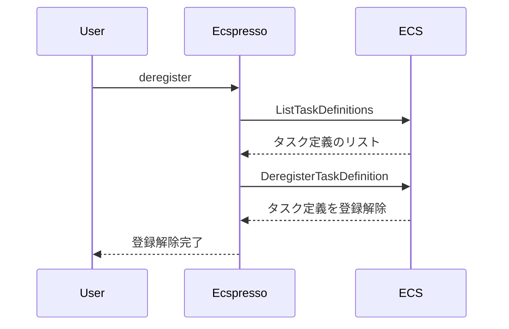

# deregister

`deregister`コマンドは、ECSタスク定義を登録解除するために使用します。

## 構文

```
ecspresso deregister [オプション]
```

## オプション

| オプション | 説明 | デフォルト値 |
|------------|------|-------------|
| `--dry-run` | 実際の変更を行わずに実行内容を表示 | `false` |
| `--revision` | 登録解除するタスク定義のリビジョン | 最新のリビジョン |
| `--no-latest` | 最新のタスク定義を登録解除しない | `false` |
| `--keep` | 保持するリビジョンの数 | `0` |

## 使用例

### 最新のタスク定義を登録解除

```bash
ecspresso deregister
```

### 特定のリビジョンを登録解除

```bash
ecspresso deregister --revision 10
```

### 最新の5つのリビジョンを残して古いリビジョンを登録解除

```bash
ecspresso deregister --keep 5
```

### ドライランモードでの実行

```bash
ecspresso deregister --dry-run
```

## 登録解除プロセス

タスク定義を登録解除すると、そのタスク定義を使用して新しいタスクを起動できなくなります。ただし、既に実行中のタスクには影響しません。



## 注意事項

- 登録解除されたタスク定義は、新しいタスクの起動に使用できなくなりますが、AWS管理コンソールでは引き続き表示されます（INACTIVE状態）。
- 実行中のタスクが使用しているタスク定義を登録解除しても、そのタスクには影響しません。
- `--keep`オプションを使用すると、最新のN個のリビジョンを保持し、それ以外のすべてのリビジョンを登録解除できます。

## 関連コマンド

- [register](./register.html) - タスク定義を登録
- [revisions](./revisions.html) - タスク定義のリビジョンを表示
