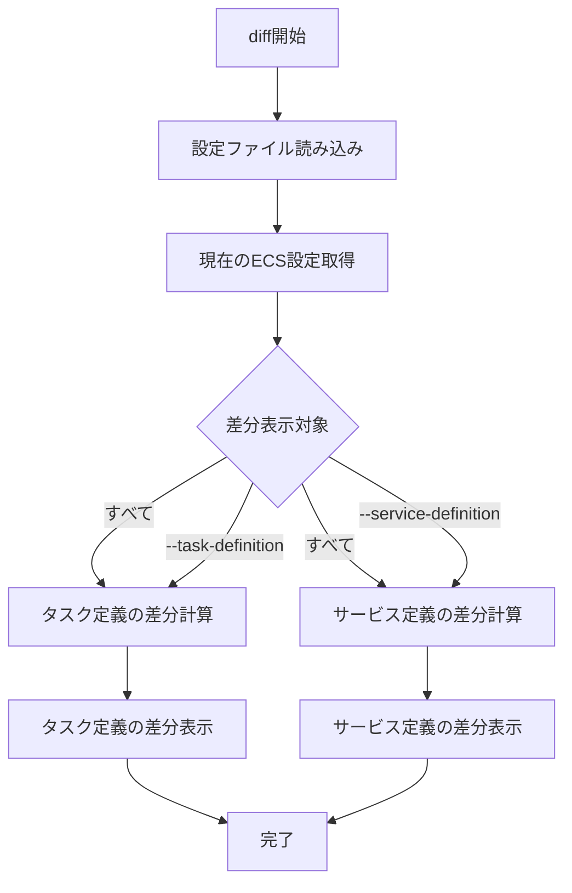

# diff

`diff`コマンドは、現在のECS設定と新しい設定の差分を表示します。デプロイ前に変更内容を確認するのに役立ちます。

## 基本的な使い方

```console
$ ecspresso diff --config ecspresso.yml
```

## オプション

| オプション | 説明 | デフォルト値 |
|------------|------|-------------|
| `--config FILE` | 設定ファイルのパス | `ecspresso.yml` |
| `--task-definition` | タスク定義の差分のみを表示 | `false` |
| `--service-definition` | サービス定義の差分のみを表示 | `false` |
| `--unified N` | 差分表示の前後のコンテキスト行数 | `3` |
| `--color` | 差分表示に色を付ける | `true` |
| `--no-color` | 差分表示に色を付けない | `false` |

## 使用例

### すべての定義ファイルの差分を表示

```console
$ ecspresso diff --config ecspresso.yml
```

### タスク定義の差分のみを表示

```console
$ ecspresso diff --config ecspresso.yml --task-definition
```

### サービス定義の差分のみを表示

```console
$ ecspresso diff --config ecspresso.yml --service-definition
```

### コンテキスト行数を変更して差分を表示

```console
$ ecspresso diff --config ecspresso.yml --unified 5
```

## 差分表示フロー

`diff`コマンドの実行フローは以下の通りです：



## 差分表示の見方

差分表示は、Unix `diff`コマンドの出力形式に似ています：

- `+` で始まる行は、新しい設定で追加された行
- `-` で始まる行は、現在の設定から削除される行
- 変更がない行は、そのまま表示されます

例：

```diff
 {
   "family": "your-service",
   "containerDefinitions": [
     {
       "name": "app",
-      "image": "123456789012.dkr.ecr.ap-northeast-1.amazonaws.com/your-service:v1",
+      "image": "123456789012.dkr.ecr.ap-northeast-1.amazonaws.com/your-service:v2",
       "essential": true,
       "portMappings": [
         {
           "containerPort": 80,
           "hostPort": 80,
           "protocol": "tcp"
         }
       ]
     }
   ]
 }
```

## 注意事項

- `diff`コマンドは実際のデプロイを行わず、変更内容を表示するだけです
- サービスが存在しない場合、すべての内容が新規追加として表示されます
- 差分がない場合は、「No diff」というメッセージが表示されます
- 大きな差分がある場合は、`--unified`オプションで表示するコンテキスト行数を調整すると見やすくなります
