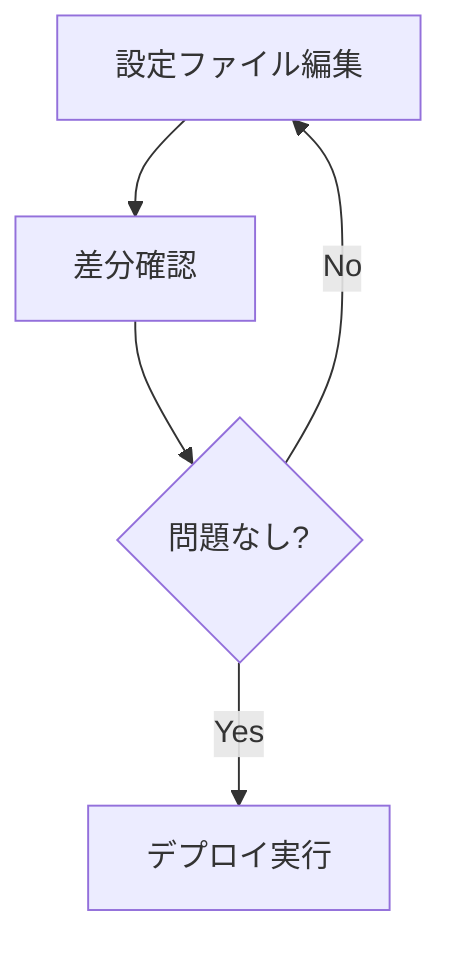

# diff

`diff`コマンドは、タスク定義、サービス定義と実行中のサービス間の差分を表示します。デプロイ前に変更内容を確認するのに役立ちます。

## 構文

```
ecspresso diff [オプション]
```

## オプション

| オプション | 説明 | デフォルト値 |
|------------|------|-------------|
| `--config-only` | 設定ファイルのみの差分を表示 | `false` |
| `--task-definition-only` | タスク定義のみの差分を表示 | `false` |
| `--service-definition-only` | サービス定義のみの差分を表示 | `false` |
| `--unified-context N` | 差分表示のコンテキスト行数 | `3` |
| `--color/--no-color` | 差分の色付け表示を有効/無効にする | `true` |

## 使用例

### 基本的な使用方法

```bash
ecspresso diff
```

### タスク定義のみの差分を表示

```bash
ecspresso diff --task-definition-only
```

### サービス定義のみの差分を表示

```bash
ecspresso diff --service-definition-only
```

### 差分表示のコンテキスト行数を変更

```bash
ecspresso diff --unified-context 5
```

## 差分表示の例

```diff
--- ecs-task-def.json
+++ new-task-definition
@@ -1,7 +1,7 @@
 {
   "family": "myapp",
   "containerDefinitions": [
     {
-      "image": "myapp:v1",
+      "image": "myapp:v2",
       "name": "app"
     }
   ]
```

## 差分確認のワークフロー



## 注意事項

- `diff`コマンドは実際の変更を行わず、変更内容のプレビューのみを表示します。
- 差分がない場合は何も表示されません。
- デプロイ前に`diff`コマンドを実行して変更内容を確認することをお勧めします。

## 関連コマンド

- [deploy](./deploy.html) - サービスをデプロイ
- [verify](./verify.html) - 設定内のリソースを検証
- [render](./render.html) - 設定、サービス定義、またはタスク定義ファイルをSTDOUTに出力
