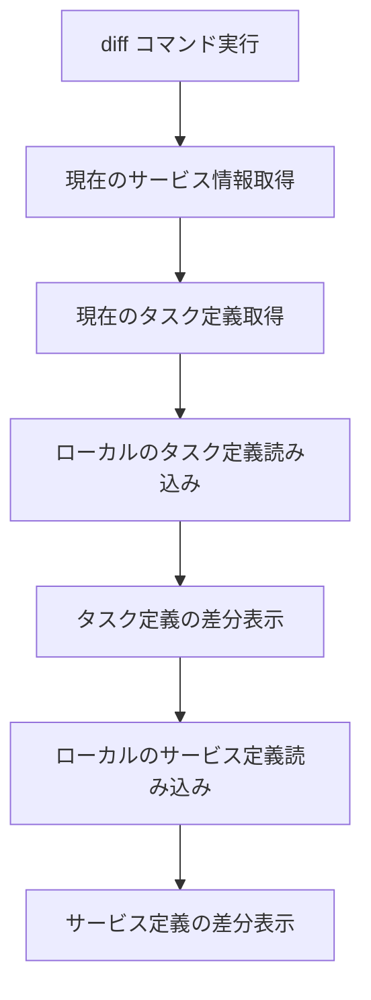

# diff

`diff`コマンドは、ローカルの設定ファイル（タスク定義、サービス定義）と現在デプロイされているECSリソースとの差分を表示します。これにより、デプロイ前に変更内容を確認できます。

## 基本的な使い方

```bash
ecspresso diff
```

## オプション

| オプション | 説明 | デフォルト値 |
|------------|------|------------|
| `--unified` | 統一差分形式で表示 | `true` |
| `--no-unified` | 統一差分形式を無効化 | - |
| `--external` | 差分表示に使用する外部コマンド | 環境変数 `ECSPRESSO_DIFF_COMMAND` |

## 差分表示の対象

`diff`コマンドは以下の差分を表示します：

1. **タスク定義の差分**
   - ローカルのタスク定義ファイル（`ecs-task-def.json`）と現在のタスク定義の差分

2. **サービス定義の差分**
   - ローカルのサービス定義ファイル（`ecs-service-def.json`）と現在のサービス設定の差分

## 差分表示の形式

デフォルトでは、差分は統一差分形式（unified diff format）で表示されます。この形式では、変更された行の前後のコンテキストも表示されます。

```diff
--- Current
+++ Local
@@ -10,7 +10,7 @@
     "containerDefinitions": [
         {
             "name": "app",
-            "image": "nginx:1.19",
+            "image": "nginx:1.20",
             "cpu": 256,
             "memory": 512,
             "essential": true,
```

統一差分形式を無効にするには、`--no-unified`オプションを使用します：

```bash
ecspresso diff --no-unified
```

## 外部コマンドによる差分表示

`--external`オプションを使用すると、差分表示に外部コマンドを使用できます。例えば、`colordiff`や`delta`などのツールを使用して、より見やすい差分表示が可能です。

```bash
# colordiffを使用
ecspresso diff --external="colordiff"

# deltaを使用
ecspresso diff --external="delta"
```

環境変数`ECSPRESSO_DIFF_COMMAND`を設定することもできます：

```bash
export ECSPRESSO_DIFF_COMMAND="colordiff"
ecspresso diff
```

## 差分表示プロセス



## 使用例

### 基本的な差分表示

```bash
ecspresso diff
```

### 統一差分形式を無効にして表示

```bash
ecspresso diff --no-unified
```

### 外部コマンドを使用して差分表示

```bash
ecspresso diff --external="colordiff"
```

## 注意事項

- サービスが存在しない場合は、エラーが発生します。
- 差分がない場合は、「No diff」と表示されます。
- タスク定義やサービス定義ファイルが存在しない場合は、エラーが発生します。
- 外部コマンドを指定した場合、そのコマンドがインストールされていることを確認してください。
