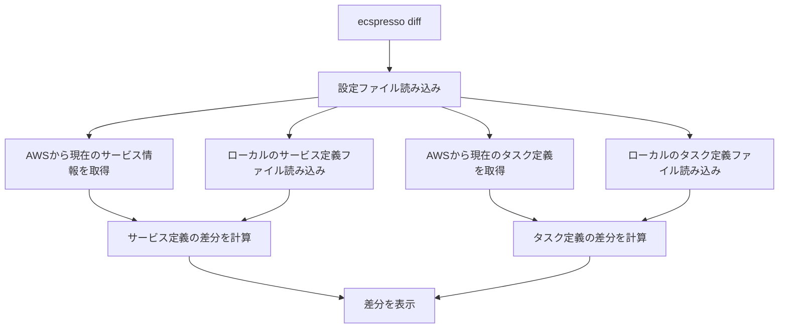

# diff

`diff`コマンドは、タスク定義、サービス定義と現在実行中のサービスとタスク定義の差分を表示します。

## 基本的な使い方

```bash
ecspresso diff --config CONFIG_FILE
```

## オプション

| オプション | 説明 | デフォルト値 |
|------------|------|-------------|
| `--config` | 設定ファイルのパス | `ecspresso.yml` |
| `--task-definition` | タスク定義ファイルのパス | 設定ファイルで指定されたパス |
| `--service-definition` | サービス定義ファイルのパス | 設定ファイルで指定されたパス |
| `--unified` | 統合フォーマットで差分を表示するかどうか | `false` |
| `--color` | 差分を色付きで表示するかどうか | `true` |
| `--no-color` | 差分を色なしで表示するかどうか | `false` |
| `--ignore-values` | 無視する値のパターン（正規表現） | - |
| `--ignore-tags` | 無視するタグのパターン（正規表現） | - |

## 詳細

`diff`コマンドは、以下の差分を表示します：

1. タスク定義ファイルと現在実行中のタスク定義の差分
2. サービス定義ファイルと現在実行中のサービスの差分

このコマンドは、デプロイ前に変更内容を確認するのに役立ちます。

## 出力例

```diff
--- /tmp/ecspresso/20230101-123456-current-task-definition.json
+++ /tmp/ecspresso/20230101-123456-new-task-definition.json
@@ -1,7 +1,7 @@
 {
   "containerDefinitions": [
     {
-      "image": "nginx:1.19",
+      "image": "nginx:1.20",
       "name": "nginx",
       "essential": true
     }
```

## 使用例

### 基本的な使用例

```bash
ecspresso diff --config ecspresso.yml
```

### 統合フォーマットで差分を表示する例

```bash
ecspresso diff --config ecspresso.yml --unified
```

### 色なしで差分を表示する例

```bash
ecspresso diff --config ecspresso.yml --no-color
```

### 特定の値を無視する例

```bash
ecspresso diff --config ecspresso.yml --ignore-values "createdAt|updatedAt"
```

### 特定のタグを無視する例

```bash
ecspresso diff --config ecspresso.yml --ignore-tags "ecspresso:ignore"
```

## ワークフロー


