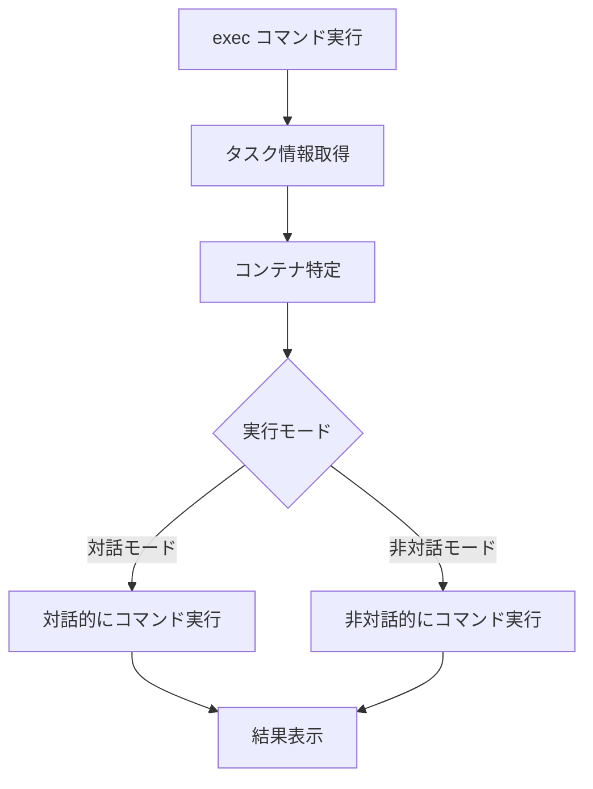

# exec

`exec`コマンドは、実行中のECSタスク上でコマンドを実行します。デバッグやトラブルシューティングに役立ちます。

## 基本的な使い方

```bash
ecspresso exec --task-id=your-task-id --command="ls -la"
```

## オプション

| オプション | 説明 | デフォルト値 |
|------------|------|------------|
| `--task-id` | コマンドを実行するタスクID | - |
| `--container` | コマンドを実行するコンテナ名 | タスク定義の最初のコンテナ |
| `--command` | 実行するコマンド | - |
| `--interactive` | 対話モードで実行 | `false` |
| `--no-interactive` | 対話モードを無効化 | - |
| `--timeout` | タイムアウト時間 | 設定ファイルの`timeout`値 |

## コマンド実行プロセス

`exec`コマンドは以下のステップを実行します：

1. 指定されたタスクIDのタスクを取得
2. コンテナを特定（指定されていない場合は最初のコンテナ）
3. コマンドを実行
4. 結果を表示



## 対話モード

`--interactive`オプションを使用すると、対話モードでコマンドを実行できます。これにより、標準入力からの入力を受け付けるコマンド（シェルなど）を実行できます。

```bash
ecspresso exec --task-id=your-task-id --command="/bin/bash" --interactive
```

対話モードでは、以下のキー操作が使用できます：

- `Ctrl+C` - 実行中のコマンドを中断
- `Ctrl+D` - 入力の終了（EOF）

## タスクIDの取得

`exec`コマンドを使用する前に、`tasks`コマンドでタスクIDを取得できます：

```bash
# タスクIDを取得
ecspresso tasks --status=RUNNING --id-only

# 取得したタスクIDでコマンドを実行
ecspresso exec --task-id=your-task-id --command="ls -la"
```

## 使用例

### 基本的なコマンド実行

```bash
ecspresso exec --task-id=your-task-id --command="ls -la"
```

### 特定のコンテナでコマンド実行

```bash
ecspresso exec --task-id=your-task-id --container=app --command="ps aux"
```

### 対話モードでシェルを実行

```bash
ecspresso exec --task-id=your-task-id --command="/bin/bash" --interactive
```

### 環境変数の確認

```bash
ecspresso exec --task-id=your-task-id --command="env"
```

### ファイルの内容を表示

```bash
ecspresso exec --task-id=your-task-id --command="cat /path/to/file"
```

## シェルスクリプトとの組み合わせ

`exec`コマンドは、シェルスクリプトと組み合わせて使用することで、より高度な操作が可能です：

```bash
# 実行中のすべてのタスクでコマンドを実行
for task_id in $(ecspresso tasks --status=RUNNING --id-only); do
  echo "Executing command on task $task_id"
  ecspresso exec --task-id=$task_id --command="df -h"
done
```

## 注意事項

- `--task-id`オプションは必須です。
- 指定したタスクが存在しない場合は、エラーが発生します。
- 指定したコンテナが存在しない場合は、エラーが発生します。
- ECS Execが有効になっていない場合は、エラーが発生します。ECS Execを有効にするには、タスク定義で`enableExecuteCommand`を`true`に設定する必要があります。
- タスクが実行されているECSクラスターでもECS Execが有効になっている必要があります。
