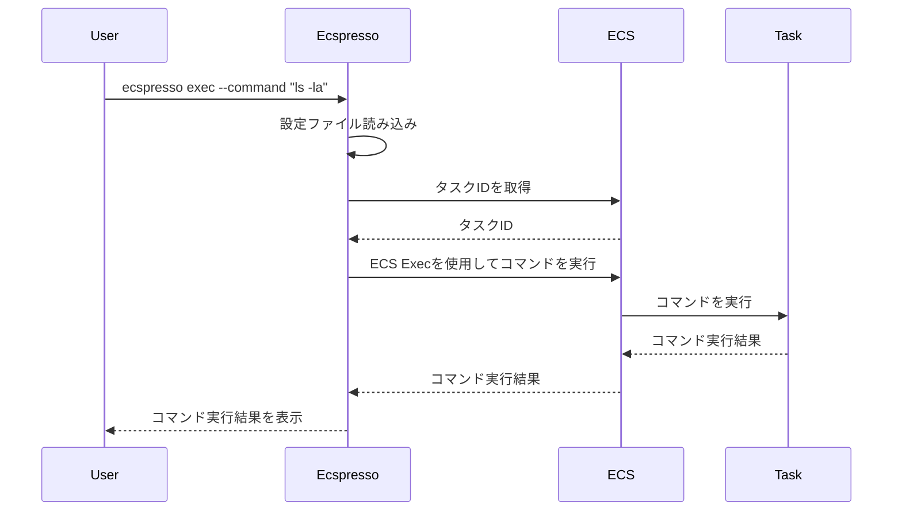

# exec

`exec`コマンドは、タスク上でコマンドを実行します。

## 基本的な使い方

```bash
ecspresso exec --config CONFIG_FILE --command "COMMAND"
```

## オプション

| オプション | 説明 | デフォルト値 |
|------------|------|-------------|
| `--config` | 設定ファイルのパス | `ecspresso.yml` |
| `--command` | 実行するコマンド | - |
| `--container` | コマンドを実行するコンテナ名 | - |
| `--cluster` | ECSクラスター名 | 設定ファイルで指定されたクラスター |
| `--service` | サービス名 | 設定ファイルで指定されたサービス |
| `--task-id` | タスクID | - |
| `--task-definition-family` | タスク定義ファミリー | - |
| `--interactive` | インタラクティブモードを使用するかどうか | `false` |
| `--tty` | TTYを割り当てるかどうか | `false` |
| `--timeout` | タイムアウト時間 | `10m` |

## 詳細

`exec`コマンドは、AWS ECS Execを使用してタスク上でコマンドを実行します。このコマンドを使用するには、以下の条件を満たす必要があります：

1. タスクがECS Execをサポートしている（プラットフォームバージョン1.4.0以上）
2. タスク定義でECS Execが有効になっている
3. タスク実行ロールにECS Execの権限がある

このコマンドは、タスク上でのデバッグやトラブルシューティングに役立ちます。

## 実行フロー



## 使用例

### 基本的な使用例

```bash
ecspresso exec --config ecspresso.yml --command "ls -la"
```

### 特定のコンテナでコマンドを実行する例

```bash
ecspresso exec --config ecspresso.yml --container nginx --command "ls -la"
```

### 特定のタスクでコマンドを実行する例

```bash
ecspresso exec --config ecspresso.yml --task-id 1234567890abcdef0 --command "ls -la"
```

### インタラクティブモードでコマンドを実行する例

```bash
ecspresso exec --config ecspresso.yml --interactive --tty --command "bash"
```

### タイムアウトを指定する例

```bash
ecspresso exec --config ecspresso.yml --command "ls -la" --timeout 5m
```

## ECS Execの設定

ECS Execを使用するには、タスク定義でECS Execを有効にする必要があります。以下は、タスク定義でECS Execを有効にする例です：

```json
{
  "family": "myapp",
  "executionRoleArn": "arn:aws:iam::123456789012:role/ecsTaskExecutionRole",
  "taskRoleArn": "arn:aws:iam::123456789012:role/ecsTaskRole",
  "containerDefinitions": [
    {
      "name": "app",
      "image": "nginx:latest",
      "essential": true
    }
  ],
  "requiresCompatibilities": [
    "FARGATE"
  ],
  "networkMode": "awsvpc",
  "cpu": "256",
  "memory": "512",
  "enableExecuteCommand": true
}
```

また、タスク実行ロールに以下の権限が必要です：

```json
{
  "Version": "2012-10-17",
  "Statement": [
    {
      "Effect": "Allow",
      "Action": [
        "ssmmessages:CreateControlChannel",
        "ssmmessages:CreateDataChannel",
        "ssmmessages:OpenControlChannel",
        "ssmmessages:OpenDataChannel"
      ],
      "Resource": "*"
    }
  ]
}
```

## インタラクティブモード

`--interactive`オプションと`--tty`オプションを使用すると、インタラクティブモードでコマンドを実行できます。これにより、タスク上でシェルを起動し、対話的にコマンドを実行できます。

```bash
ecspresso exec --config ecspresso.yml --interactive --tty --command "bash"
```

このコマンドは、タスク上でbashシェルを起動し、対話的にコマンドを実行できます。
