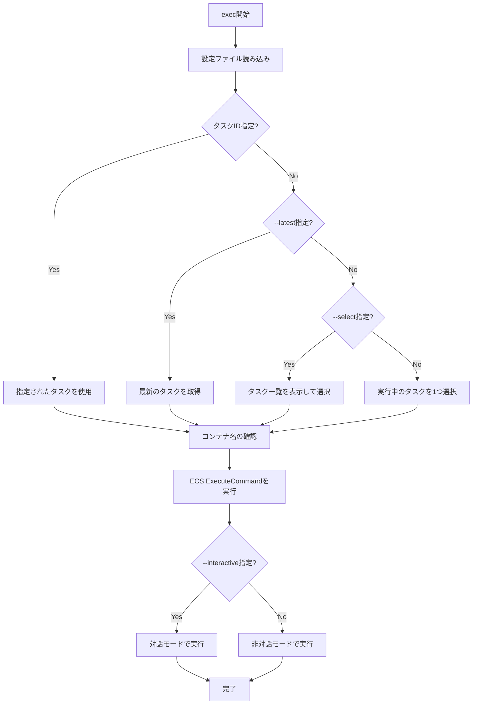

# exec

`exec`コマンドは、実行中のECSタスクでコマンドを実行します。コンテナ内でデバッグやメンテナンス作業を行うのに便利です。

## 基本的な使い方

```console
$ ecspresso exec --config ecspresso.yml --command "ls -la" --container app
```

## オプション

| オプション | 説明 | デフォルト値 |
|------------|------|-------------|
| `--config FILE` | 設定ファイルのパス | `ecspresso.yml` |
| `--command COMMAND` | 実行するコマンド | - |
| `--container NAME` | コマンドを実行するコンテナ名 | タスク定義の最初のコンテナ |
| `--task-id TASK_ID` | コマンドを実行するタスクID | - |
| `--interactive` | 対話モードで実行 | `false` |
| `--latest` | 最新のタスクを選択 | `false` |
| `--select` | タスクを選択するプロンプトを表示 | `false` |

## 使用例

### 特定のコマンドを実行

```console
$ ecspresso exec --config ecspresso.yml --command "ls -la" --container app
```

### 対話モードでシェルを起動

```console
$ ecspresso exec --config ecspresso.yml --command "/bin/bash" --container app --interactive
```

### 最新のタスクでコマンドを実行

```console
$ ecspresso exec --config ecspresso.yml --command "ps aux" --container app --latest
```

### タスクを選択してコマンドを実行

```console
$ ecspresso exec --config ecspresso.yml --command "env" --container app --select
```

### 特定のタスクIDでコマンドを実行

```console
$ ecspresso exec --config ecspresso.yml --command "cat /etc/hosts" --container app --task-id arn:aws:ecs:ap-northeast-1:123456789012:task/your-cluster/1234567890abcdef0
```

## 実行フロー

`exec`コマンドの実行フローは以下の通りです：



## 前提条件

`exec`コマンドを使用するには、以下の前提条件があります：

1. ECS ExecuteCommandが有効になっていること
   - タスク定義で`enableExecuteCommand: true`が設定されていること
   - ECSクラスターでExecuteCommandが有効になっていること

2. 適切なIAM権限があること
   - `ecs:ExecuteCommand`アクション
   - SSMセッションの管理に必要な権限

3. AWS CLIまたはSession Managerプラグインがインストールされていること

## 注意事項

- `exec`コマンドは、AWS ECS ExecuteCommand機能を使用しています
- Fargate、EC2の両方の起動タイプで使用できます
- コンテナ内でコマンドを実行するため、コンテナにコマンドがインストールされている必要があります
- 対話モード（`--interactive`）では、ターミナルが必要です
- セキュリティ上の理由から、ExecuteCommandの使用はAWS CloudTrailでログに記録されます
