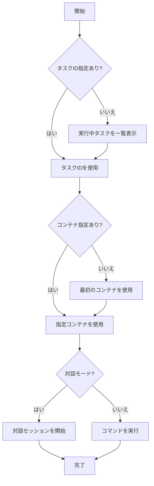

# exec

`exec`コマンドは、実行中のECSタスク内でコマンドを実行するためのコマンドです。デバッグやトラブルシューティングに役立ちます。

## 基本的な使い方

```console
$ ecspresso exec [オプション] -- [コマンド]
```

## オプション

| オプション | 説明 | デフォルト値 |
|------------|------|------------|
| `--config` | 設定ファイルのパス | `ecspresso.yml` |
| `--container` | コマンドを実行するコンテナ名 | タスク定義の最初のコンテナ |
| `--interactive` | 対話モードを有効化 | `false` |
| `--task-id` | 特定のタスクIDを指定 | - |
| `--timeout` | タイムアウト時間 | 設定ファイルの`timeout`値（デフォルト: 10分） |
| `--command` | 実行するコマンド（`--`の後に指定することも可能） | - |

## 出力例

```
2023/01/01 12:00:00 [info] myservice/default Starting exec
2023/01/01 12:00:00 [info] myservice/default Task ID: 12345678-1234-1234-1234-123456789012
2023/01/01 12:00:00 [info] myservice/default Container: web
2023/01/01 12:00:00 [info] myservice/default Command: ls -la
total 64
drwxr-xr-x  1 root root 4096 Jan  1 12:00 .
drwxr-xr-x  1 root root 4096 Jan  1 12:00 ..
-rw-r--r--  1 root root  220 Jan  1 12:00 .bash_logout
-rw-r--r--  1 root root 3771 Jan  1 12:00 .bashrc
-rw-r--r--  1 root root  807 Jan  1 12:00 .profile
drwxr-xr-x  3 root root 4096 Jan  1 12:00 app
drwxr-xr-x  2 root root 4096 Jan  1 12:00 etc
drwxr-xr-x  2 root root 4096 Jan  1 12:00 var
```

## 使用例

### 基本的な使用方法

```console
$ ecspresso exec --config ecspresso.yml -- ls -la
```

### 特定のコンテナを指定

```console
$ ecspresso exec --config ecspresso.yml --container worker -- ps aux
```

### 対話モードを使用

```console
$ ecspresso exec --config ecspresso.yml --interactive -- /bin/bash
```

### 特定のタスクIDを指定

```console
$ ecspresso exec --config ecspresso.yml --task-id 12345678-1234-1234-1234-123456789012 -- ls -la
```

### タイムアウト時間を指定

```console
$ ecspresso exec --config ecspresso.yml --timeout 5m -- ls -la
```

### コマンドオプションを使用

```console
$ ecspresso exec --config ecspresso.yml --command "ls -la"
```

## 実行プロセス

`exec`コマンドは、以下のプロセスでコマンドを実行します：

1. タスクIDが指定されていない場合は、サービスの実行中タスクを一覧表示して選択
2. 指定されたコンテナ（または最初のコンテナ）にコマンドを送信
3. コマンドの実行結果を表示
4. 対話モードの場合は、ユーザーの入力を受け付けてコンテナに送信



## 対話モード

`--interactive`オプションを使用すると、コンテナ内でシェルを対話的に操作できます。これは、複数のコマンドを実行したり、環境を調査したりする場合に便利です。

対話モードでは、以下のことが可能です：

1. コマンドの入力と実行
2. 環境変数の確認
3. ファイルシステムの調査
4. プロセスの確認
5. ネットワーク接続の確認

例えば、以下のようにしてコンテナ内でシェルを起動できます：

```console
$ ecspresso exec --config ecspresso.yml --interactive -- /bin/bash
root@12345678-1234:/# ls -la
total 64
drwxr-xr-x  1 root root 4096 Jan  1 12:00 .
drwxr-xr-x  1 root root 4096 Jan  1 12:00 ..
-rw-r--r--  1 root root  220 Jan  1 12:00 .bash_logout
-rw-r--r--  1 root root 3771 Jan  1 12:00 .bashrc
-rw-r--r--  1 root root  807 Jan  1 12:00 .profile
drwxr-xr-x  3 root root 4096 Jan  1 12:00 app
drwxr-xr-x  2 root root 4096 Jan  1 12:00 etc
drwxr-xr-x  2 root root 4096 Jan  1 12:00 var
root@12345678-1234:/# ps aux
USER       PID %CPU %MEM    VSZ   RSS TTY      STAT START   TIME COMMAND
root         1  0.0  0.1  18504  3408 ?        Ss   12:00   0:00 /bin/bash
root        14  0.0  0.1  34400  2880 ?        R+   12:01   0:00 ps aux
root@12345678-1234:/# exit
exit
```

## タスクの選択

タスクIDを指定しない場合、`exec`コマンドは実行中のタスクを一覧表示し、ユーザーに選択を求めます：

```
2023/01/01 12:00:00 [info] myservice/default Starting exec
2023/01/01 12:00:00 [info] myservice/default Select task:
1. 12345678-1234-1234-1234-123456789012 (RUNNING)
2. 87654321-4321-4321-4321-210987654321 (RUNNING)
Select task number (1-2): 
```

## 注意事項

- `exec`コマンドは、AWSリソースとの通信を行うため、AWS認証情報が正しく設定されている必要があります
- `exec`コマンドを使用するには、タスクが実行中である必要があります
- 対話モードを使用する場合は、コンテナ内にシェル（`/bin/bash`、`/bin/sh`など）がインストールされている必要があります
- セキュリティ上の理由から、本番環境での`exec`コマンドの使用は制限することをお勧めします
- `exec`コマンドは、AWS ECS Execの機能を使用しているため、タスクの実行ロールに適切な権限が必要です
- タスク定義で`enableExecuteCommand`が`true`に設定されている必要があります

## 必要な権限

`exec`コマンドを使用するには、以下の権限が必要です：

```json
{
  "Version": "2012-10-17",
  "Statement": [
    {
      "Effect": "Allow",
      "Action": [
        "ecs:ExecuteCommand",
        "ecs:DescribeTasks"
      ],
      "Resource": "*"
    },
    {
      "Effect": "Allow",
      "Action": [
        "ssmmessages:CreateControlChannel",
        "ssmmessages:CreateDataChannel",
        "ssmmessages:OpenControlChannel",
        "ssmmessages:OpenDataChannel"
      ],
      "Resource": "*"
    }
  ]
}
```

## タスク定義の設定

`exec`コマンドを使用するには、タスク定義で`enableExecuteCommand`を`true`に設定する必要があります：

```json
{
  "family": "myservice",
  "containerDefinitions": [
    {
      "name": "web",
      "image": "nginx:latest",
      "essential": true
    }
  ],
  "executionRoleArn": "arn:aws:iam::123456789012:role/ecsTaskExecutionRole",
  "networkMode": "awsvpc",
  "requiresCompatibilities": [
    "FARGATE"
  ],
  "cpu": "256",
  "memory": "512",
  "enableExecuteCommand": true
}
```

## 関連コマンド

- [run](./run.html) - 一時的なタスクを実行
- [status](./status.html) - サービスの状態を表示
- [tasks](./tasks.html) - タスクの一覧を表示
- [deploy](./deploy.html) - サービスをデプロイ
