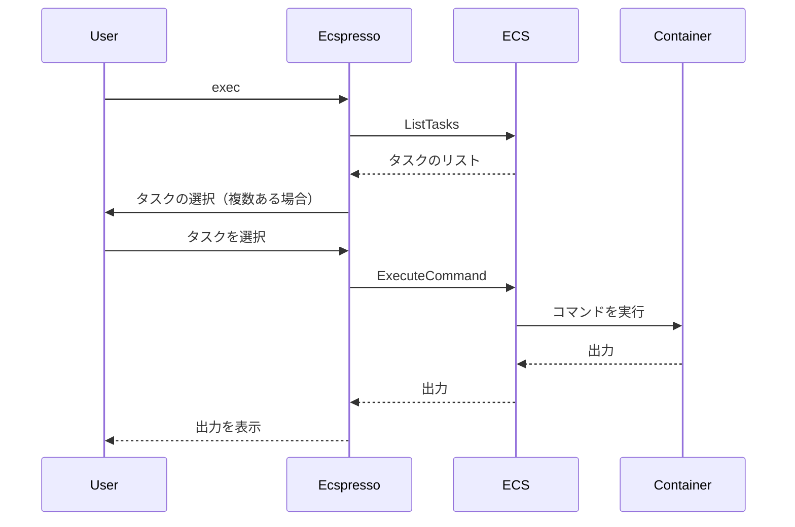

# exec

`exec`コマンドは、実行中のECSタスク上でコマンドを実行するために使用します。これは、デバッグやメンテナンス作業に役立ちます。

## 構文

```
ecspresso exec [オプション]
```

## オプション

| オプション | 説明 | デフォルト値 |
|------------|------|-------------|
| `--id` | タスクID | （自動選択） |
| `--command` | 実行するコマンド | `/bin/bash` |
| `--container` | コマンドを実行するコンテナ名 | （最初のコンテナ） |
| `--interactive/--no-interactive` | 対話モードを有効/無効にする | `true` |
| `--tty/--no-tty` | TTYを割り当てるかどうか | `true` |
| `--running-only/--no-running-only` | 実行中のタスクのみを対象にするかどうか | `true` |
| `--filter` | タスクをフィルタリングするための式 | `` |

## 使用例

### 基本的な使用方法（対話的シェルを起動）

```bash
ecspresso exec
```

### 特定のタスクでコマンドを実行

```bash
ecspresso exec --id 12345678-1234-1234-1234-123456789012
```

### 特定のコンテナでコマンドを実行

```bash
ecspresso exec --container app --command "ls -la"
```

### 非対話モードでコマンドを実行

```bash
ecspresso exec --no-interactive --command "cat /var/log/app.log"
```

## 実行プロセス

`exec`コマンドは、AWS ECS ExecuteCommandAPIを使用してタスク上でコマンドを実行します。このAPIを使用するには、タスク定義とクラスターでECS Execが有効になっている必要があります。



## ECS Execの有効化

`exec`コマンドを使用するには、タスク定義とクラスターでECS Execが有効になっている必要があります。

タスク定義での設定例：

```json
{
  "containerDefinitions": [
    {
      "name": "app",
      "image": "myapp:latest",
      "essential": true,
      "linuxParameters": {
        "initProcessEnabled": true
      }
    }
  ],
  "executionRoleArn": "arn:aws:iam::123456789012:role/ecsTaskExecutionRole",
  "taskRoleArn": "arn:aws:iam::123456789012:role/ecsTaskRole",
  "enableExecuteCommand": true
}
```

クラスターでの設定例：

```bash
aws ecs update-cluster-settings --cluster your-cluster --settings name=containerInsights,value=enabled
```

## 関連コマンド

- [run](./run.html) - タスクを実行
- [tasks](./tasks.html) - サービス内またはタスク定義ファミリー内のタスクを一覧表示
