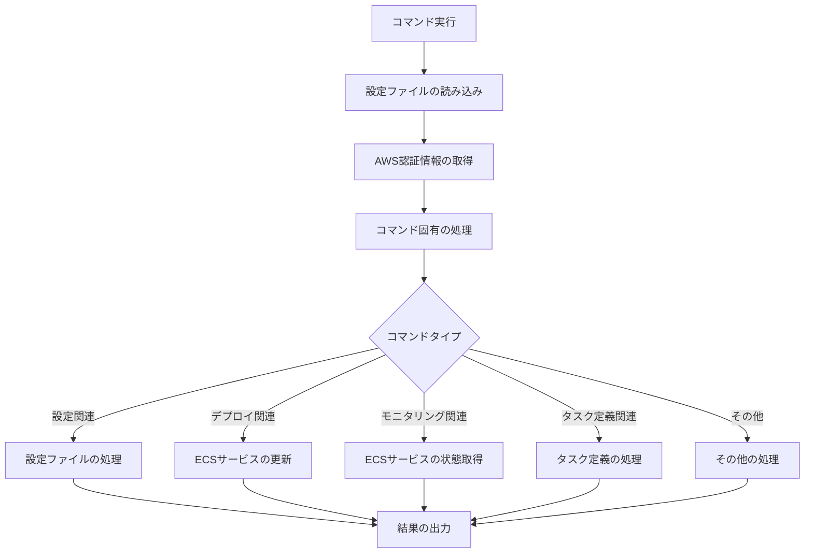

# コマンドリファレンス

ecspressoは、ECSサービスとタスクを管理するための様々なコマンドを提供しています。このセクションでは、各コマンドの詳細な使い方を説明します。

## コマンド一覧

ecspressoは以下のコマンドを提供しています：

### 設定関連

- [init](./init.html) - 設定ファイルの初期化
- [render](./render.html) - 設定ファイルのレンダリング
- [verify](./verify.html) - 設定ファイルの検証
- [diff](./diff.html) - 現在のECS設定と新しい設定の差分表示

### デプロイ関連

- [deploy](./deploy.html) - ECSサービスのデプロイ
- [rollback](./rollback.html) - 以前のタスク定義にロールバック
- [refresh](./refresh.html) - サービスの更新（タスク定義は変更せず）
- [scale](./scale.html) - サービスのスケーリング
- [delete](./delete.html) - サービスの削除

### モニタリング関連

- [status](./status.html) - サービスの状態確認
- [wait](./wait.html) - サービスが安定するまで待機
- [exec](./exec.html) - 実行中のタスクでコマンドを実行
- [tasks](./tasks.html) - タスク一覧の表示

### タスク定義関連

- [register](./register.html) - タスク定義の登録
- [deregister](./deregister.html) - タスク定義の登録解除
- [revisions](./revisions.html) - タスク定義のリビジョン一覧表示
- [run](./run.html) - 一時的なタスクの実行

### その他

- [appspec](./appspec.html) - CodeDeployのAppSpecファイル生成
- [version](./version.html) - バージョン情報の表示

## コマンドの基本構造

ecspressoのコマンドは以下の基本構造に従います：

```
ecspresso [グローバルオプション] コマンド [コマンドオプション]
```

### グローバルオプション

すべてのコマンドで使用できる主なグローバルオプションは以下の通りです：

- `--config FILE` - 設定ファイルのパス（デフォルト: `ecspresso.yml`）
- `--debug` - デバッグログの有効化
- `--envfile FILE` - 環境変数ファイルのパス
- `--help` - ヘルプの表示
- `--no-color` - カラー出力の無効化
- `--profile PROFILE` - AWS認証情報のプロファイル名
- `--quiet` - 出力の抑制
- `--region REGION` - AWSリージョン

## コマンドの実行フロー

ecspressoのコマンド実行フローは以下の通りです：


