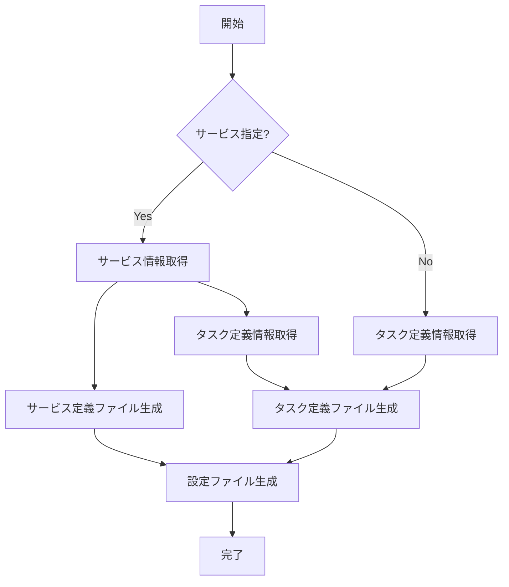

# init

`init`コマンドは、既存のECSサービスからecspressoの設定ファイルを初期化するために使用します。

## 基本的な使い方

```bash
ecspresso init [オプション]
```

## オプション

| オプション | 説明 | デフォルト値 |
|------------|------|------------|
| `--region` | AWSリージョン | 環境変数 `AWS_REGION` |
| `--cluster` | ECSクラスター名 | default |
| `--service` | ECSサービス名（必須） | - |
| `--task-definition` | ECSタスク定義名:リビジョン（サービスの代わりに指定可能） | - |
| `--task-definition-path` | タスク定義出力先ファイルパス | ecs-task-def.json |
| `--service-definition-path` | サービス定義出力先ファイルパス | ecs-service-def.json |
| `--sort` | タスク定義内の要素をソート | false |
| `--force-overwrite` | 既存ファイルを上書き | false |
| `--jsonnet` | jsonnet形式でファイルを出力 | false |

## 使用例

### 基本的な初期化

```bash
ecspresso init --region ap-northeast-1 --cluster your-cluster --service your-service
```

### 既存のタスク定義からの初期化

```bash
ecspresso init --region ap-northeast-1 --task-definition your-task-definition:1
```

### jsonnet形式での出力

```bash
ecspresso init --region ap-northeast-1 --cluster your-cluster --service your-service --jsonnet
```

### カスタムファイルパスの指定

```bash
ecspresso init --service your-service --task-definition-path task-def.json --service-definition-path service-def.json
```

## 詳細

`init`コマンドは以下の処理を行います：

1. 既存のECSサービスまたはタスク定義から情報を取得
2. ecspresso設定ファイル（デフォルト: `ecspresso.yml`）を生成
3. サービス定義ファイル（デフォルト: `ecs-service-def.json`）を生成（`--service`オプションを使用した場合）
4. タスク定義ファイル（デフォルト: `ecs-task-def.json`）を生成

CodeDeployを使用している場合は、関連する設定も`ecspresso.yml`に追加されます。

## 初期化フロー


