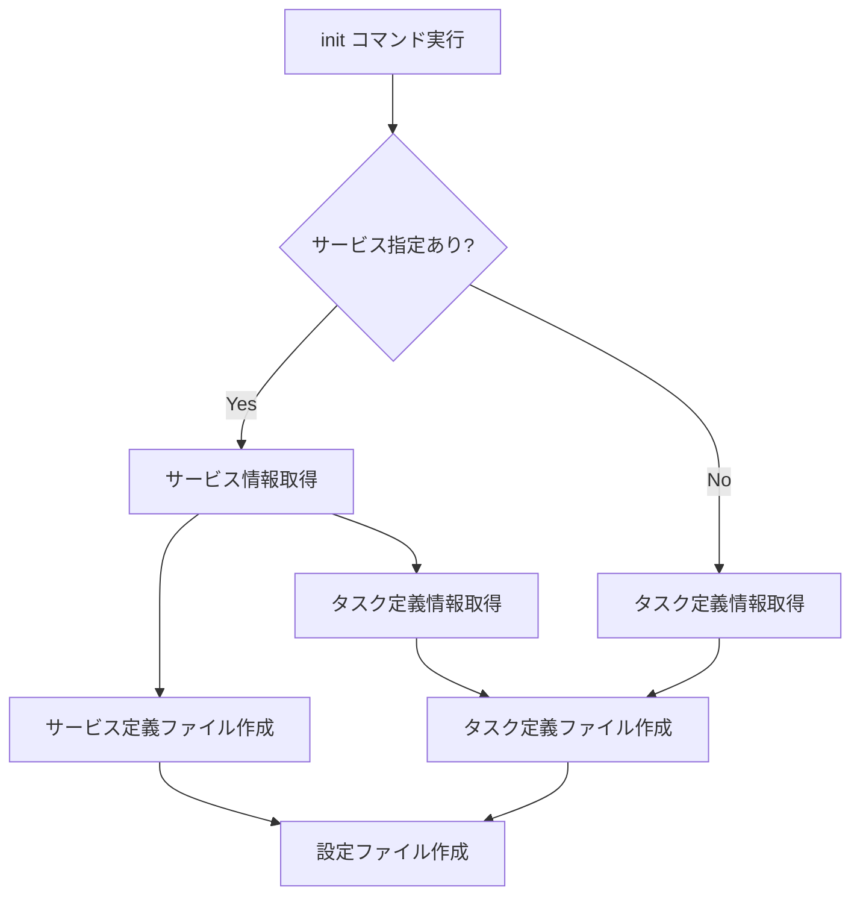

# init

`init`コマンドは、既存のECSサービスまたはタスク定義から設定ファイルを作成します。これは、ecspressoを使い始める際の最初のステップです。

## 基本的な使い方

```bash
ecspresso init --region ap-northeast-1 --cluster your-cluster --service your-service
```

または、タスク定義から初期化する場合：

```bash
ecspresso init --region ap-northeast-1 --cluster your-cluster --task-definition your-task-definition:1
```

## オプション

| オプション | 説明 | デフォルト値 |
|------------|------|------------|
| `--region` | AWS リージョン | 環境変数 `AWS_REGION` |
| `--cluster` | ECS クラスター名 | `default` |
| `--service` | ECS サービス名 | - |
| `--task-definition` | ECS タスク定義名:リビジョン | - |
| `--task-definition-path` | タスク定義ファイルの出力パス | `ecs-task-def.json` |
| `--service-definition-path` | サービス定義ファイルの出力パス | `ecs-service-def.json` |
| `--sort` | タスク定義の要素をソート | `false` |
| `--force-overwrite` | 既存のファイルを上書き | `false` |
| `--jsonnet` | Jsonnet形式で出力 | `false` |

## 出力ファイル

`init`コマンドは以下のファイルを生成します：

1. `ecspresso.yml` - ecspressoの設定ファイル
2. `ecs-service-def.json` - ECSサービス定義ファイル（`--service`オプションを使用した場合）
3. `ecs-task-def.json` - ECSタスク定義ファイル

## 設定ファイルの例

生成される`ecspresso.yml`の例：

```yaml
region: ap-northeast-1
cluster: your-cluster
service: your-service
service_definition: ecs-service-def.json
task_definition: ecs-task-def.json
timeout: 10m
```

CodeDeployを使用している場合は、以下のような設定も追加されます：

```yaml
codedeploy:
  application_name: AppECS-your-cluster-your-service
  deployment_group_name: DgpECS-your-cluster-your-service
```

## Jsonnet形式での出力

`--jsonnet`オプションを使用すると、JSON形式の代わりにJsonnet形式でファイルが出力されます。これにより、変数や関数を使用して設定ファイルをより柔軟に管理できます。

```bash
ecspresso init --region ap-northeast-1 --cluster your-cluster --service your-service --jsonnet
```

この場合、出力ファイルの拡張子は`.jsonnet`になります：

- `ecspresso.jsonnet`
- `ecs-service-def.jsonnet`
- `ecs-task-def.jsonnet`

## 初期化プロセスのフロー



## 使用例

### 既存のサービスから初期化

```bash
ecspresso init --region ap-northeast-1 --cluster my-cluster --service my-service
```

### タスク定義から初期化

```bash
ecspresso init --region ap-northeast-1 --cluster my-cluster --task-definition my-task:3
```

### Jsonnet形式で出力

```bash
ecspresso init --region ap-northeast-1 --cluster my-cluster --service my-service --jsonnet
```

### ファイルパスを指定して初期化

```bash
ecspresso init --region ap-northeast-1 --cluster my-cluster --service my-service \
  --task-definition-path my-task-def.json \
  --service-definition-path my-service-def.json
```

## 注意事項

- `--service`と`--task-definition`オプションは排他的です。どちらか一方のみを指定してください。
- 既存のファイルがある場合、`--force-overwrite`オプションを指定しない限り、上書きの確認が表示されます。
- サービスが見つからない場合は、エラーが発生します。
