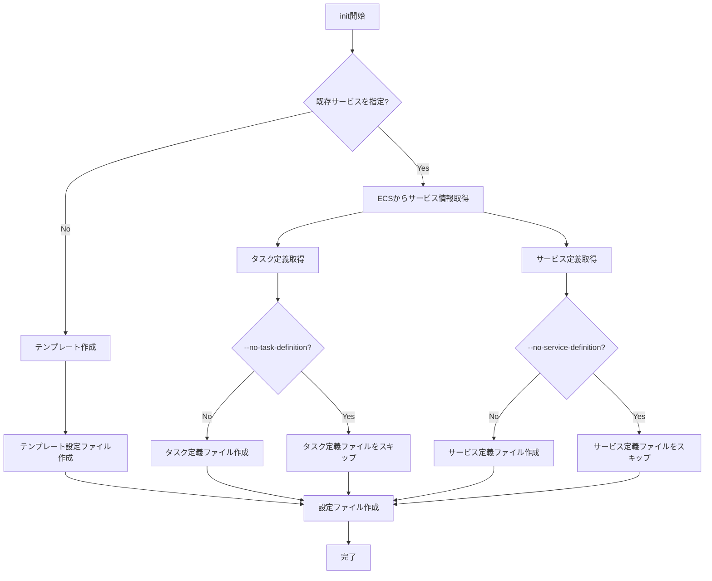

# init

`init`コマンドは、ecspressoの設定ファイル、タスク定義、サービス定義を初期化するために使用します。既存のECSサービスから設定を取得したり、新しいサービスのためのテンプレートを作成したりできます。

## 基本的な使い方

```console
$ ecspresso init --region ap-northeast-1 --cluster your-cluster --service your-service --config ecspresso.yml
```

## オプション

| オプション | 説明 | デフォルト値 |
|------------|------|-------------|
| `--region REGION` | AWSリージョン | 環境変数またはAWS設定ファイルから取得 |
| `--cluster CLUSTER` | ECSクラスター名 | - |
| `--service SERVICE` | ECSサービス名 | - |
| `--config FILE` | 設定ファイルのパス | `ecspresso.yml` |
| `--task-definition FILE` | タスク定義ファイルのパス | `ecs-task-def.json` |
| `--service-definition FILE` | サービス定義ファイルのパス | `ecs-service-def.json` |
| `--appspec FILE` | AppSpecファイルのパス（CodeDeployを使用する場合） | - |
| `--no-task-definition` | タスク定義ファイルを生成しない | `false` |
| `--no-service-definition` | サービス定義ファイルを生成しない | `false` |
| `--output-format FORMAT` | 出力形式（`json`または`yaml`） | `json` |
| `--format FORMAT` | 設定ファイルの形式（`yaml`または`json`） | `yaml` |
| `--dry-run` | 実際にファイルを作成せずに、生成される内容を表示 | `false` |

## 使用例

### 既存のサービスから設定を初期化

```console
$ ecspresso init --region ap-northeast-1 --cluster your-cluster --service your-service --config ecspresso.yml
```

### YAML形式で出力

```console
$ ecspresso init --region ap-northeast-1 --cluster your-cluster --service your-service --config ecspresso.yml --output-format yaml
```

### タスク定義のみを生成

```console
$ ecspresso init --region ap-northeast-1 --cluster your-cluster --service your-service --config ecspresso.yml --no-service-definition
```

### ドライランモード

```console
$ ecspresso init --region ap-northeast-1 --cluster your-cluster --service your-service --config ecspresso.yml --dry-run
```

## 生成されるファイル

`init`コマンドは、以下のファイルを生成します：

1. 設定ファイル（デフォルト: `ecspresso.yml`）
   ```yaml
   region: ap-northeast-1
   cluster: your-cluster
   service: your-service
   task_definition: ecs-task-def.json
   service_definition: ecs-service-def.json
   timeout: 10m
   ```

2. タスク定義ファイル（デフォルト: `ecs-task-def.json`）
   - 既存のサービスのタスク定義をJSON形式で保存

3. サービス定義ファイル（デフォルト: `ecs-service-def.json`）
   - 既存のサービスの設定をJSON形式で保存

## 初期化フロー

`init`コマンドの実行フローは以下の通りです：



## 注意事項

- 既存のサービスから初期化する場合、そのサービスに対する読み取り権限が必要です
- 生成されたファイルは、必要に応じて編集できます
- `--output-format`オプションで、タスク定義とサービス定義の出力形式を指定できます
- `--format`オプションで、設定ファイルの形式を指定できます
