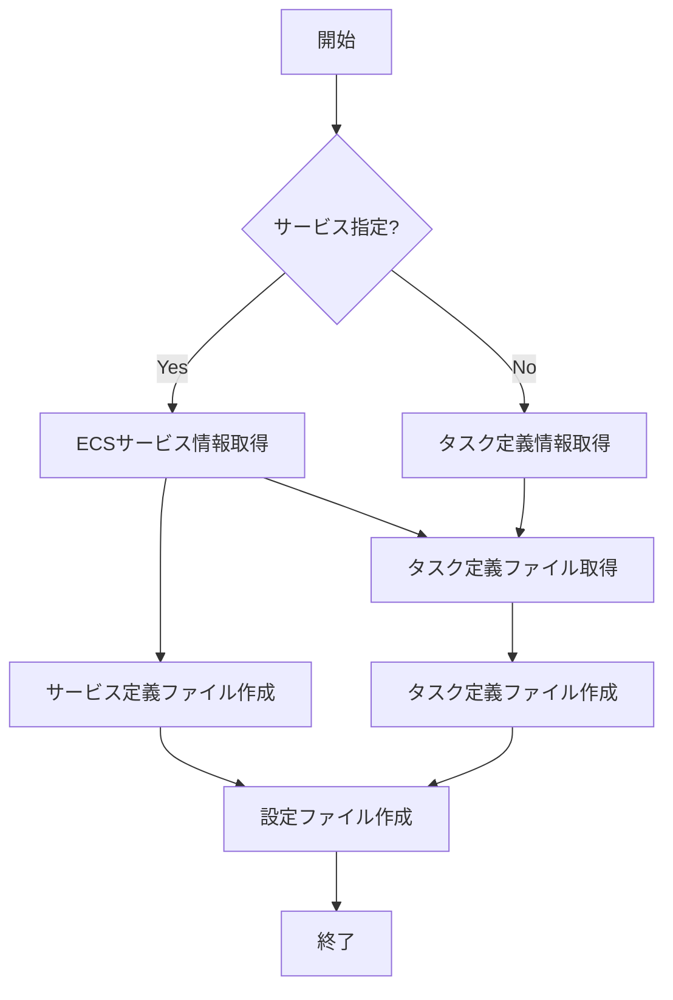

# init

`init`コマンドは、既存のECSサービスまたはタスク定義から、ecspressoの設定ファイルとリソース定義ファイルを作成します。

## 構文

```
ecspresso init [オプション]
```

## オプション

| オプション | 説明 | デフォルト値 |
|------------|------|-------------|
| `--region` | AWS リージョン | AWS_REGION環境変数の値 |
| `--cluster` | ECSクラスター名 | `default` |
| `--service` | ECSサービス名 | （必須） |
| `--task-definition` | ECSタスク定義の名前:リビジョン | （必須） |
| `--task-definition-path` | 出力するタスク定義ファイルのパス | `ecs-task-def.json` |
| `--service-definition-path` | 出力するサービス定義ファイルのパス | `ecs-service-def.json` |
| `--sort/--no-sort` | タスク定義の要素をソートするか | `false` |
| `--force-overwrite` | 既存のファイルを上書きするか | `false` |
| `--jsonnet` | ファイルをjsonnet形式で出力するか | `false` |

※ `--service`と`--task-definition`は排他的です。

## 使用例

### 既存のサービスから初期化

```bash
ecspresso init --region ap-northeast-1 --cluster my-cluster --service my-service
```

### 特定のタスク定義から初期化

```bash
ecspresso init --region ap-northeast-1 --cluster my-cluster --task-definition my-family:3
```

### Jsonnet形式での出力

```bash
ecspresso init --region ap-northeast-1 --cluster my-cluster --service my-service --jsonnet
```

## 初期化プロセス図



## 出力ファイル

init コマンドは次のファイルを生成します：

1. `ecspresso.yml` - ecspressoの設定ファイル
2. `ecs-service-def.json` - ECSサービス定義（`--service`指定時のみ）
3. `ecs-task-def.json` - ECSタスク定義

## 関連コマンド

- [render](./render.html) - 設定、サービス定義、またはタスク定義ファイルをSTDOUTに出力
- [verify](./verify.html) - 設定内のリソースを検証
