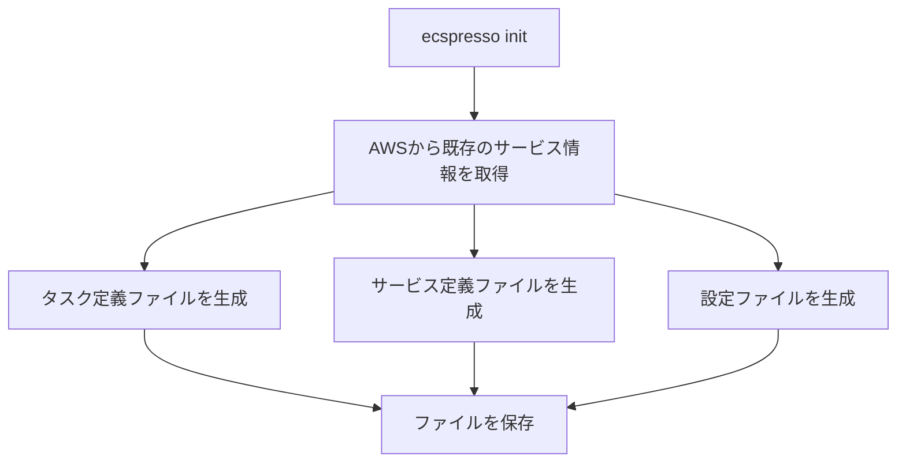

# init

`init`コマンドは、既存のECSサービスから設定ファイルを作成します。

## 基本的な使い方

```bash
ecspresso init --region REGION --cluster CLUSTER_NAME --service SERVICE_NAME --config CONFIG_FILE
```

## オプション

| オプション | 説明 | デフォルト値 |
|------------|------|-------------|
| `--region` | AWSリージョン | 環境変数`AWS_REGION`の値 |
| `--cluster` | ECSクラスター名 | - |
| `--service` | ECSサービス名 | - |
| `--config` | 生成する設定ファイルのパス | `ecspresso.yml` |
| `--task-definition` | 生成するタスク定義ファイルのパス | `ecs-task-def.json` |
| `--service-definition` | 生成するサービス定義ファイルのパス | `ecs-service-def.json` |
| `--appspec` | AppSpecファイルを生成するかどうか | `false` |
| `--no-wait` | サービスが安定するまで待機しないかどうか | `false` |
| `--output-format` | 出力形式（json, jsonnet, yaml） | `json` |

## 詳細

`init`コマンドは、既存のECSサービスから以下のファイルを生成します：

1. 設定ファイル（デフォルト：`ecspresso.yml`）
2. タスク定義ファイル（デフォルト：`ecs-task-def.json`）
3. サービス定義ファイル（デフォルト：`ecs-service-def.json`）

生成されたファイルは、そのままデプロイに使用できます。

## 設定ファイルの例

```yaml
region: ap-northeast-1
cluster: default
service: myservice
task_definition: ecs-task-def.json
service_definition: ecs-service-def.json
timeout: 10m
```

## 使用例

### 基本的な使用例

```bash
ecspresso init --region ap-northeast-1 --cluster default --service myservice
```

### 出力ファイルのパスを指定する例

```bash
ecspresso init --region ap-northeast-1 --cluster default --service myservice \
  --config my-config.yml \
  --task-definition my-task-def.json \
  --service-definition my-service-def.json
```

### Jsonnet形式で出力する例

```bash
ecspresso init --region ap-northeast-1 --cluster default --service myservice \
  --output-format jsonnet
```

### AppSpecファイルを生成する例

```bash
ecspresso init --region ap-northeast-1 --cluster default --service myservice \
  --appspec
```

## ワークフロー


