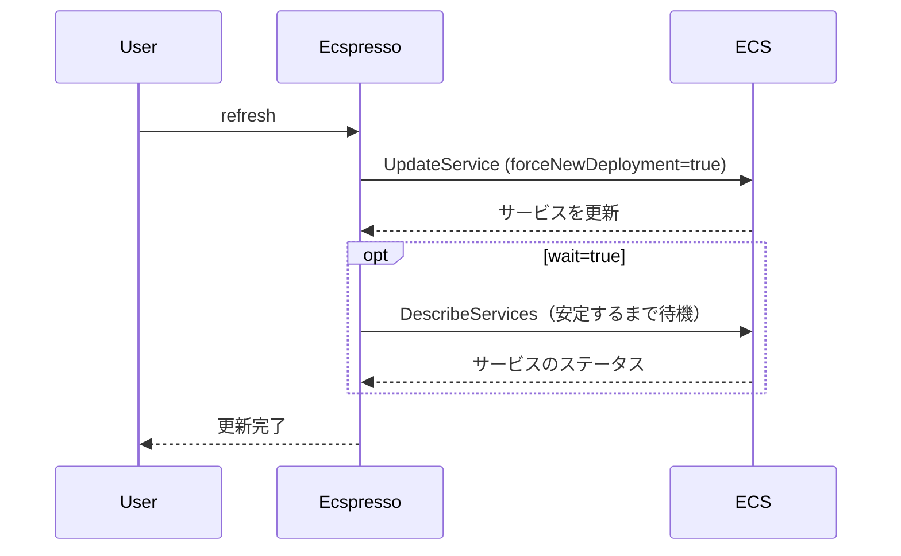

# refresh

`refresh`コマンドは、ECSサービスを更新するために使用します。このコマンドは、`deploy --skip-task-definition --force-new-deployment --no-update-service`と同等の機能を持ちます。

## 構文

```
ecspresso refresh [オプション]
```

## オプション

| オプション | 説明 | デフォルト値 |
|------------|------|-------------|
| `--dry-run` | 実際の変更を行わずに実行内容を表示 | `false` |
| `--wait/--no-wait` | サービスが安定するまで待機するかどうか | `true` |
| `--wait-until` | どの状態まで待機するか（stable/deployed） | `stable` |

## 使用例

### 基本的な使用方法

```bash
ecspresso refresh
```

### ドライランモードでの実行

```bash
ecspresso refresh --dry-run
```

### 待機せずに更新

```bash
ecspresso refresh --no-wait
```

## リフレッシュプロセス

`refresh`コマンドは、新しいタスク定義を登録せず、サービス定義も更新せずに、強制的に新しいデプロイメントを作成します。これは、コンテナインスタンスの問題やその他の理由でタスクを再起動したい場合に役立ちます。



## ユースケース

- コンテナインスタンスの問題によりタスクを再起動したい場合
- 同じタスク定義を使用して新しいデプロイメントを強制したい場合
- サービスの設定を変更せずにタスクを再配置したい場合

## 関連コマンド

- [deploy](./deploy.html) - サービスをデプロイ
- [scale](./scale.html) - サービスをスケール（タスク数を変更）
