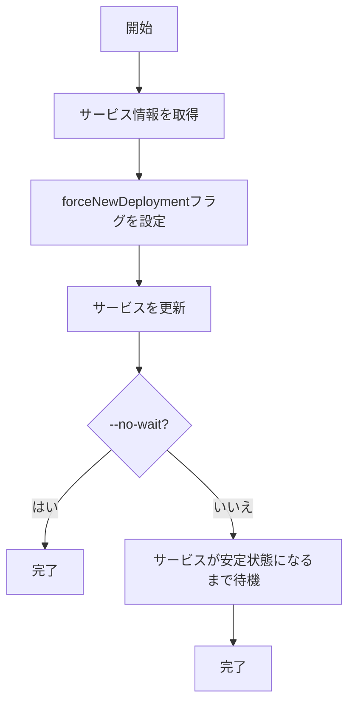

# refresh

`refresh`コマンドは、ECSサービスの設定を最新の状態に更新するためのコマンドです。サービス定義やタスク定義を変更せずに、サービスを再起動したい場合に使用します。

## 基本的な使い方

```console
$ ecspresso refresh [オプション]
```

## オプション

| オプション | 説明 | デフォルト値 |
|------------|------|------------|
| `--config` | 設定ファイルのパス | `ecspresso.yml` |
| `--dry-run` | 実際に更新せずに実行内容を表示 | `false` |
| `--no-wait` | サービスが安定状態になるのを待たない | `false` |
| `--suspend-auto-scaling` | デプロイ中に自動スケーリングを一時停止 | `false` |
| `--resume-auto-scaling` | デプロイ後に自動スケーリングを再開 | `false` |

## 出力例

```
2023/01/01 12:00:00 [info] myservice/default Starting refresh
2023/01/01 12:00:00 [info] myservice/default Refreshing service: myservice
2023/01/01 12:00:00 [info] myservice/default Service is stable now. Completed!
```

## 使用例

### 基本的な使用方法

```console
$ ecspresso refresh --config ecspresso.yml
```

### ドライラン

```console
$ ecspresso refresh --config ecspresso.yml --dry-run
```

### 安定状態を待たない

```console
$ ecspresso refresh --config ecspresso.yml --no-wait
```

### 自動スケーリングを一時停止して再開

```console
$ ecspresso refresh --config ecspresso.yml --suspend-auto-scaling --resume-auto-scaling
```

## リフレッシュプロセス

`refresh`コマンドは、以下のプロセスでサービスをリフレッシュします：

1. 現在のサービス情報を取得
2. サービスを更新して、`forceNewDeployment`フラグを設定
3. サービスが安定状態になるまで待機（`--no-wait`オプションが指定されていない場合）



## リフレッシュの用途

`refresh`コマンドは、以下のような場合に役立ちます：

1. **コンテナの再起動**: サービスのすべてのコンテナを再起動したい場合
2. **ホストの再配置**: タスクを別のホストに再配置したい場合
3. **設定の更新**: 環境変数やシークレットの値を更新した場合
4. **問題の解決**: サービスに問題が発生し、再起動で解決する可能性がある場合

## `refresh`と`deploy --force-new-deployment`の違い

`refresh`コマンドと`deploy --force-new-deployment`オプションは、どちらもサービスを再起動するために使用できますが、以下の違いがあります：

1. `refresh`コマンドは、タスク定義を変更せずにサービスを再起動します
2. `deploy --force-new-deployment`オプションは、新しいタスク定義を登録してからサービスを再起動します

タスク定義を変更せずにサービスを再起動したい場合は、`refresh`コマンドを使用することをお勧めします。

## CI/CDパイプラインでの使用

`refresh`コマンドは、CI/CDパイプラインでサービスを定期的に再起動するのに役立ちます。以下は、GitHub Actionsでの使用例です：

```yaml
jobs:
  refresh:
    runs-on: ubuntu-latest
    steps:
      - uses: actions/checkout@v3
      - uses: kayac/ecspresso@v2
        with:
          version: v2.3.0
      - run: |
          # サービスをリフレッシュ
          ecspresso refresh --config ecspresso.yml
```

## 注意事項

- `refresh`コマンドは、タスク定義を変更せずにサービスを再起動します
- `--dry-run`オプションを使用すると、実際に更新せずに実行内容を確認できます
- `--no-wait`オプションを使用すると、サービスが安定状態になるのを待たずにコマンドを終了できます
- `--suspend-auto-scaling`と`--resume-auto-scaling`オプションを使用すると、デプロイ中に自動スケーリングを一時停止し、デプロイ後に再開できます
- リフレッシュ操作は、サービスの更新として処理されるため、サービスの更新に関連する制限が適用されます
- Blue/Greenデプロイメントを使用している場合は、`refresh`コマンドではなく、`deploy`コマンドを使用する必要があります

## 関連コマンド

- [deploy](./deploy.html) - サービスをデプロイ
- [status](./status.html) - サービスの状態を表示
- [wait](./wait.html) - サービスが安定状態になるまで待機
