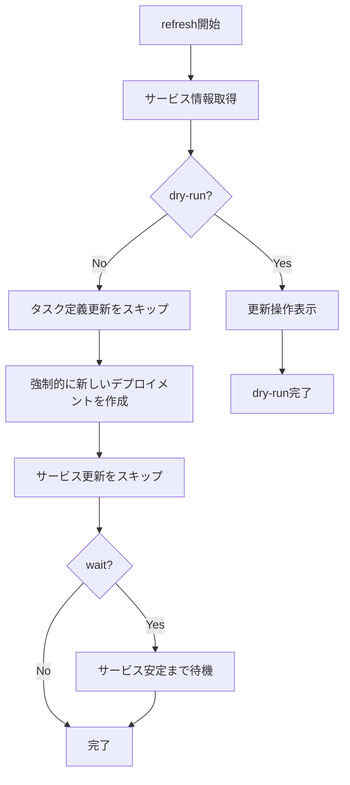

# refresh

`refresh`コマンドは、タスク定義を更新せずにECSサービスを更新します。このコマンドは、`deploy --skip-task-definition --force-new-deployment --no-update-service`と同等です。

## 基本的な使い方

```console
$ ecspresso refresh --config ecspresso.yml
```

## オプション

|| オプション | 説明 | デフォルト値 |
|------------|------|-------------|
|| `--dry-run` | 実際に更新せずに、実行される操作を表示します | `false` |
|| `--wait` | サービスが安定するまで待機します | `true` |

## 使用例

### サービスを更新

```console
$ ecspresso refresh --config ecspresso.yml
```

### ドライランモード

```console
$ ecspresso refresh --config ecspresso.yml --dry-run
```

### 待機なしでサービスを更新

```console
$ ecspresso refresh --config ecspresso.yml --no-wait
```

## 更新フロー



## ユースケース

`refresh`コマンドは以下のような場合に役立ちます：

1. 同じタスク定義を使用しているが、すべてのタスクを再起動したい場合
2. コンテナインスタンスの問題を解決するためにタスクを再配置したい場合
3. サービスの設定は変更せず、タスクのみを再デプロイしたい場合

## 注意事項

- このコマンドは新しいタスク定義を登録せず、現在のタスク定義を使用します
- サービス定義の更新も行われないため、サービスの設定は変更されません
- `--force-new-deployment`フラグが内部的に使用され、新しいデプロイメントが強制的に作成されます
