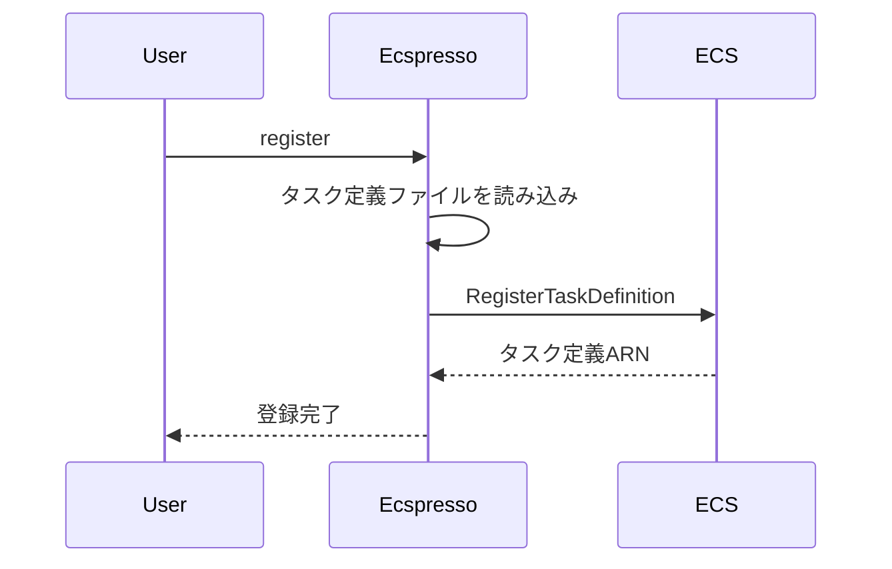

# register

`register`コマンドは、ECSタスク定義を登録するために使用します。

## 構文

```
ecspresso register [オプション]
```

## オプション

| オプション | 説明 | デフォルト値 |
|------------|------|-------------|
| `--dry-run` | 実際の変更を行わずに実行内容を表示 | `false` |
| `--output` | 登録されたタスク定義ARNの出力先ファイル | `` |
| `--skip-validation` | タスク定義の検証をスキップ | `false` |

## 使用例

### 基本的な使用方法

```bash
ecspresso register
```

### ドライランモードでの実行

```bash
ecspresso register --dry-run
```

### 登録されたタスク定義ARNをファイルに出力

```bash
ecspresso register --output task-definition-arn.txt
```

## 登録プロセス

`register`コマンドは、設定ファイルで指定されたタスク定義ファイルを読み込み、ECSにタスク定義を登録します。



## 注意事項

- タスク定義を登録しても、実行中のサービスは自動的に更新されません。サービスを更新するには、`deploy`コマンドを使用する必要があります。
- `--output`オプションを使用すると、登録されたタスク定義ARNをファイルに出力できます。これは、CI/CDパイプラインでの使用に便利です。
- `--skip-validation`オプションを使用すると、タスク定義の検証をスキップできますが、通常は推奨されません。

## 関連コマンド

- [deploy](./deploy.html) - サービスをデプロイ
- [deregister](./deregister.html) - タスク定義を登録解除
- [revisions](./revisions.html) - タスク定義のリビジョンを表示
