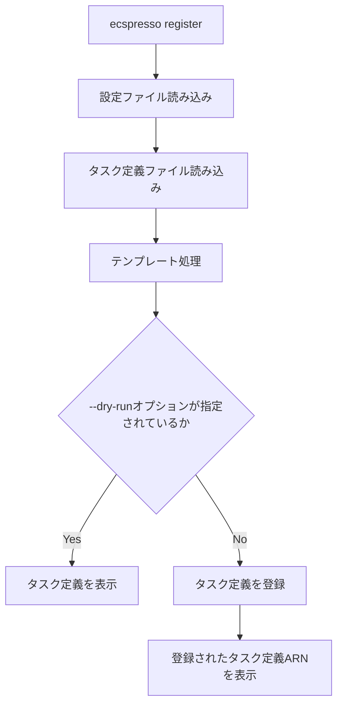

# register

`register`コマンドは、タスク定義を登録します。

## 基本的な使い方

```bash
ecspresso register --config CONFIG_FILE
```

## オプション

| オプション | 説明 | デフォルト値 |
|------------|------|-------------|
| `--config` | 設定ファイルのパス | `ecspresso.yml` |
| `--task-definition` | タスク定義ファイルのパス | 設定ファイルで指定されたパス |
| `--dry-run` | 実際に登録せずに内容を表示するかどうか | `false` |
| `--output` | 出力形式（json, yaml） | - |

## 詳細

`register`コマンドは、以下の処理を行います：

1. タスク定義ファイルを読み込む
2. テンプレート処理を行う
3. 新しいタスク定義をAWS ECSに登録する

このコマンドは、タスク定義のみを登録し、サービスの更新は行いません。サービスを更新するには、`deploy`コマンドを使用します。

## 登録フロー



## 使用例

### 基本的な使用例

```bash
ecspresso register --config ecspresso.yml
```

### ドライランモードで実行する例

```bash
ecspresso register --config ecspresso.yml --dry-run
```

### 特定のタスク定義ファイルを使用する例

```bash
ecspresso register --config ecspresso.yml --task-definition my-task-def.json
```

### JSON形式で出力する例

```bash
ecspresso register --config ecspresso.yml --output json
```

## タスク定義の例

```json
{
  "family": "myapp",
  "executionRoleArn": "arn:aws:iam::123456789012:role/ecsTaskExecutionRole",
  "taskRoleArn": "arn:aws:iam::123456789012:role/ecsTaskRole",
  "networkMode": "awsvpc",
  "containerDefinitions": [
    {
      "name": "app",
      "image": "nginx:latest",
      "essential": true,
      "portMappings": [
        {
          "containerPort": 80,
          "hostPort": 80,
          "protocol": "tcp"
        }
      ],
      "logConfiguration": {
        "logDriver": "awslogs",
        "options": {
          "awslogs-group": "/ecs/myapp",
          "awslogs-region": "ap-northeast-1",
          "awslogs-stream-prefix": "ecs"
        }
      }
    }
  ],
  "requiresCompatibilities": [
    "FARGATE"
  ],
  "cpu": "256",
  "memory": "512"
}
```

## テンプレート機能

ecspressoのテンプレート機能を使用すると、環境変数やAWSリソースの値を参照してタスク定義を動的に生成できます。

```json
{
  "family": "myapp",
  "executionRoleArn": "{{ tfstate `aws_iam_role.ecs_task_execution_role.arn` }}",
  "taskRoleArn": "{{ tfstate `aws_iam_role.ecs_task_role.arn` }}",
  "networkMode": "awsvpc",
  "containerDefinitions": [
    {
      "name": "app",
      "image": "nginx:{{ must_env `IMAGE_TAG` }}",
      "essential": true,
      "portMappings": [
        {
          "containerPort": 80,
          "hostPort": 80,
          "protocol": "tcp"
        }
      ],
      "logConfiguration": {
        "logDriver": "awslogs",
        "options": {
          "awslogs-group": "/ecs/myapp",
          "awslogs-region": "{{ must_env `AWS_REGION` }}",
          "awslogs-stream-prefix": "ecs"
        }
      }
    }
  ],
  "requiresCompatibilities": [
    "FARGATE"
  ],
  "cpu": "256",
  "memory": "512"
}
```

## タスク定義のリビジョン管理

タスク定義を登録すると、新しいリビジョンが作成されます。リビジョンは、タスク定義のバージョンを表す番号です。

例えば、タスク定義ファミリー「myapp」のリビジョン1を登録すると、ARNは「arn:aws:ecs:ap-northeast-1:123456789012:task-definition/myapp:1」になります。同じファミリーで再度登録すると、リビジョン2が作成され、ARNは「arn:aws:ecs:ap-northeast-1:123456789012:task-definition/myapp:2」になります。

`register`コマンドは、登録されたタスク定義のARNを表示します。このARNは、`deploy`コマンドや`run`コマンドで使用できます。

## タスク定義の登録と更新

タスク定義を登録しても、サービスは自動的に更新されません。サービスを更新するには、以下のいずれかの方法を使用します：

1. `deploy`コマンドを使用する
2. AWS Management Consoleでサービスを更新する
3. AWS CLIでサービスを更新する

`register`コマンドは、CI/CDパイプラインでタスク定義のみを更新する場合や、タスク定義を登録してから手動でサービスを更新する場合に役立ちます。
