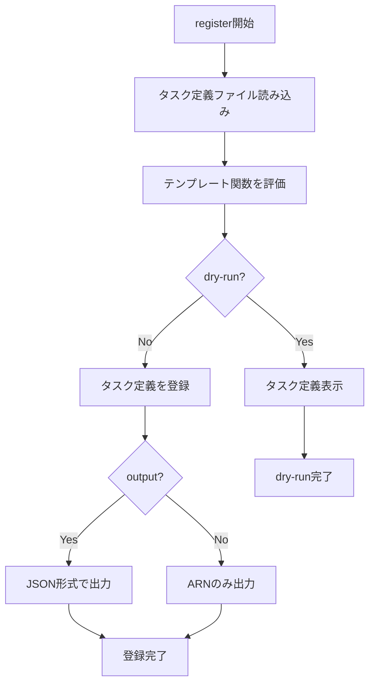

# register

`register`コマンドは、新しいタスク定義を登録するために使用します。既存のタスク定義を更新したり、新しいバージョンを登録したりできます。

## 基本的な使い方

```console
$ ecspresso register --config ecspresso.yml
```

## オプション

|| オプション | 説明 | デフォルト値 |
|------------|------|-------------|
|| `--dry-run` | 実際に登録せずに、登録されるタスク定義を表示します | `false` |
|| `--output` | 登録されたタスク定義をJSON形式で出力します | `false` |

## 使用例

### 新しいタスク定義を登録

```console
$ ecspresso register --config ecspresso.yml
```

### ドライランモード

```console
$ ecspresso register --config ecspresso.yml --dry-run
```

### 登録されたタスク定義をJSONで出力

```console
$ ecspresso register --config ecspresso.yml --output
```

## 登録フロー



## 注意事項

- タスク定義ファイル（デフォルト: `ecs-task-def.json`）の内容に基づいて新しいタスク定義が登録されます
- タスク定義ファイル内でテンプレート関数（環境変数や外部値の参照など）を使用できます
- `--output`オプションを使用すると、登録されたタスク定義の完全なJSON表現を確認できます
- 登録されたタスク定義は、`deploy`コマンドを実行するまでサービスには適用されません
