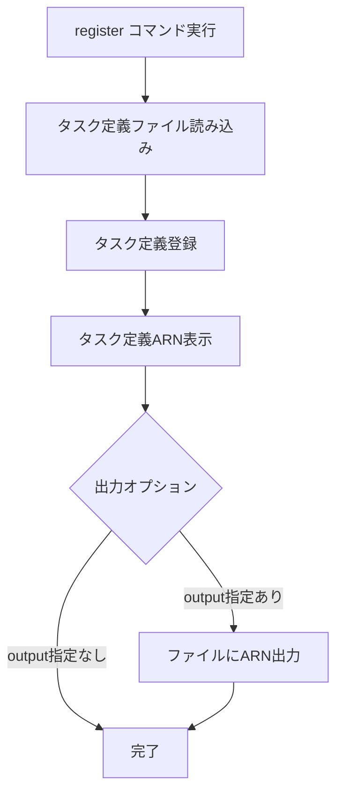

# register

`register`コマンドは、タスク定義を登録します。サービスの更新は行わず、タスク定義の登録のみを行います。

## 基本的な使い方

```bash
ecspresso register
```

## オプション

| オプション | 説明 | デフォルト値 |
|------------|------|------------|
| `--dry-run` | 実際の変更を行わずに実行 | `false` |
| `--task-def` | 登録するタスク定義ファイル | 設定ファイルの`task_definition` |
| `--output` | 登録されたタスク定義ARNの出力先ファイル | - |

## 登録プロセス

`register`コマンドは以下のステップを実行します：

1. タスク定義ファイルを読み込み
2. タスク定義を登録
3. 登録されたタスク定義ARNを表示
4. 必要に応じて出力ファイルにARNを書き込み



## 出力ファイル

`--output`オプションを使用すると、登録されたタスク定義ARNを指定したファイルに出力できます。これは、CI/CDパイプラインでタスク定義ARNを後続のステップで使用する場合に便利です。

```bash
ecspresso register --output=task-def-arn.txt
```

出力ファイルには、以下のような形式でARNが書き込まれます：

```
arn:aws:ecs:ap-northeast-1:123456789012:task-definition/your-task-definition:3
```

## 使用例

### 基本的な使用方法

```bash
ecspresso register
```

### 特定のタスク定義ファイルを登録

```bash
ecspresso register --task-def=custom-task-def.json
```

### ドライランモードで登録

```bash
ecspresso register --dry-run
```

### 登録されたARNをファイルに出力

```bash
ecspresso register --output=task-def-arn.txt
```

## CI/CDパイプラインでの使用例

CI/CDパイプラインでは、以下のようなフローでecspressoを使用することができます：

```bash
# タスク定義を登録し、ARNをファイルに出力
ecspresso register --output=task-def-arn.txt

# ARNを環境変数に設定
TASK_DEF_ARN=$(cat task-def-arn.txt)

# 他のAWSリソースの更新にARNを使用
# ...
```

## 注意事項

- `register`コマンドはタスク定義の登録のみを行い、サービスの更新は行いません。サービスを更新するには、`deploy`コマンドを使用してください。
- タスク定義ファイルが存在しない場合は、エラーが発生します。
- `--dry-run`オプションを使用すると、実際の登録は行われず、登録されるタスク定義の内容が表示されます。
