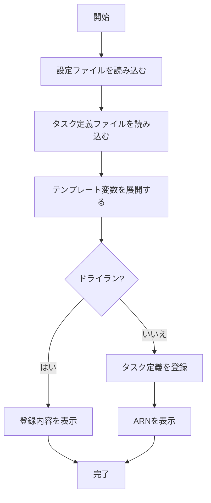

# register

`register`コマンドは、タスク定義を登録するためのコマンドです。サービスをデプロイせずに、タスク定義のみを登録したい場合に使用します。

## 基本的な使い方

```console
$ ecspresso register [オプション]
```

## オプション

| オプション | 説明 | デフォルト値 |
|------------|------|------------|
| `--config` | 設定ファイルのパス | `ecspresso.yml` |
| `--dry-run` | 実際に登録せずに実行内容を表示 | `false` |
| `--envfile` | 環境変数ファイルのパス | - |
| `--ext-str` | Jsonnet用の外部文字列値 | - |
| `--ext-code` | Jsonnet用の外部コード値 | - |
| `--output` | 登録されたタスク定義のARNを出力するファイルパス | - |

## 出力例

```
2023/01/01 12:00:00 [info] myservice/default Starting register
2023/01/01 12:00:00 [info] myservice/default Registering task definition: myservice
2023/01/01 12:00:00 [info] myservice/default Task definition is registered: arn:aws:ecs:ap-northeast-1:123456789012:task-definition/myservice:4
```

## 使用例

### 基本的な使用方法

```console
$ ecspresso register --config ecspresso.yml
```

### ドライラン

```console
$ ecspresso register --config ecspresso.yml --dry-run
```

### 環境変数ファイルを使用

```console
$ ecspresso register --config ecspresso.yml --envfile production.env
```

### Jsonnet用の外部変数を指定

```console
$ ecspresso register --config ecspresso.yml --ext-str IMAGE_TAG=v1.2.3 --ext-str ENV=production
```

### 登録されたタスク定義のARNを出力

```console
$ ecspresso register --config ecspresso.yml --output task-definition-arn.txt
```

## 登録プロセス

`register`コマンドは、以下のプロセスでタスク定義を登録します：

1. 設定ファイルからタスク定義ファイルのパスを読み込む
2. タスク定義ファイルを読み込み、テンプレート変数を展開する
3. AWS ECSにタスク定義を登録する
4. 登録されたタスク定義のARNを表示する



## タスク定義の登録と使用

タスク定義を登録すると、以下のことが可能になります：

1. `run`コマンドで一時的なタスクを実行
2. `deploy`コマンドでサービスをデプロイ（`--skip-task-definition`オプションを使用）
3. AWS Management Consoleからタスク定義を確認

タスク定義のリビジョンは自動的に管理され、新しいタスク定義を登録するたびにリビジョン番号が増加します。

## CI/CDパイプラインでの使用

`register`コマンドは、CI/CDパイプラインでタスク定義のみを登録するのに役立ちます。以下は、GitHub Actionsでの使用例です：

```yaml
jobs:
  register:
    runs-on: ubuntu-latest
    steps:
      - uses: actions/checkout@v3
      - uses: kayac/ecspresso@v2
        with:
          version: v2.3.0
      - run: |
          ecspresso register --config ecspresso.yml --output task-definition-arn.txt
          TASK_DEFINITION_ARN=$(cat task-definition-arn.txt)
          echo "TASK_DEFINITION_ARN=$TASK_DEFINITION_ARN" >> $GITHUB_ENV
      - run: |
          # 登録されたタスク定義を使用して何か処理を行う
          echo "Registered task definition: $TASK_DEFINITION_ARN"
```

## 注意事項

- `register`コマンドは、タスク定義を登録するだけで、サービスをデプロイするわけではありません
- 登録されたタスク定義を使用してサービスをデプロイするには、`deploy`コマンドを使用します
- `--dry-run`オプションを使用すると、実際に登録せずに実行内容を確認できます
- テンプレート変数を使用している場合は、`--envfile`または`--ext-str`オプションで値を指定する必要があります
- Jsonnetファイルを使用している場合は、`--ext-str`または`--ext-code`オプションで外部変数を渡すことができます
- `--output`オプションを使用すると、登録されたタスク定義のARNをファイルに出力できます
- タスク定義のリビジョンは自動的に管理され、新しいタスク定義を登録するたびにリビジョン番号が増加します

## 関連コマンド

- [deploy](./deploy.html) - サービスをデプロイ
- [deregister](./deregister.html) - タスク定義の登録を解除
- [revisions](./revisions.html) - タスク定義のリビジョンを一覧表示
- [run](./run.html) - 一時的なタスクを実行
